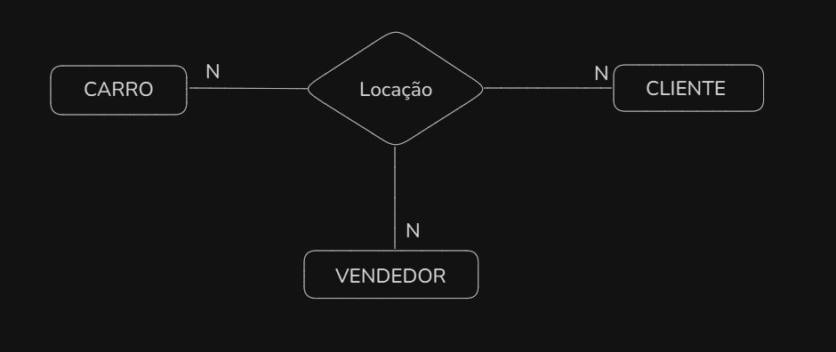
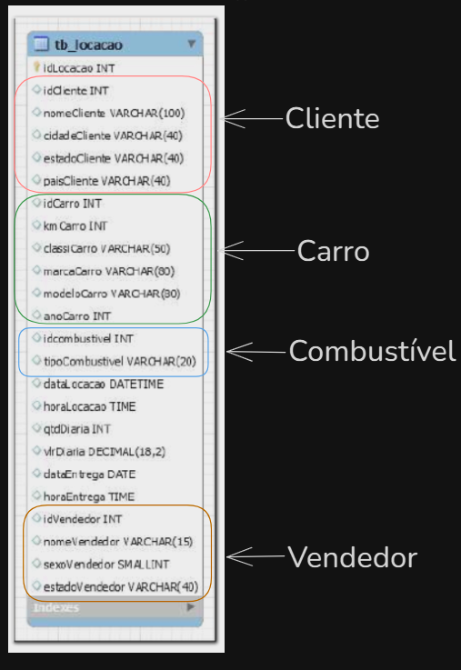
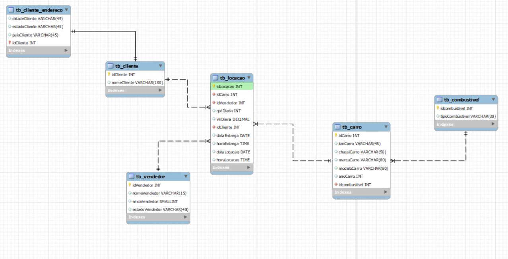
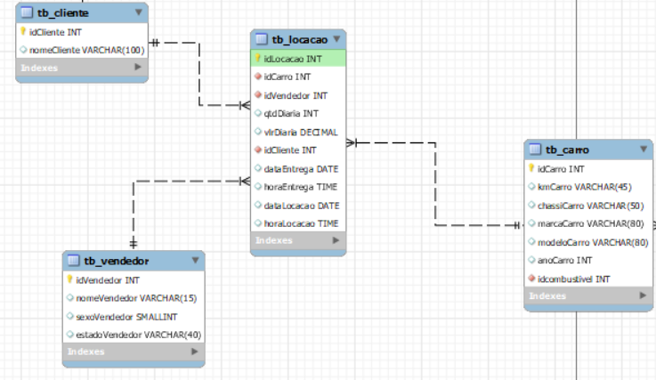
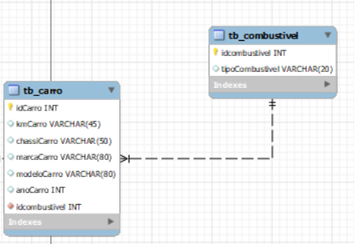
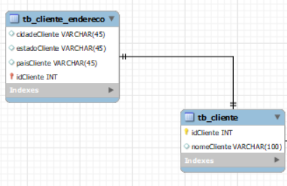
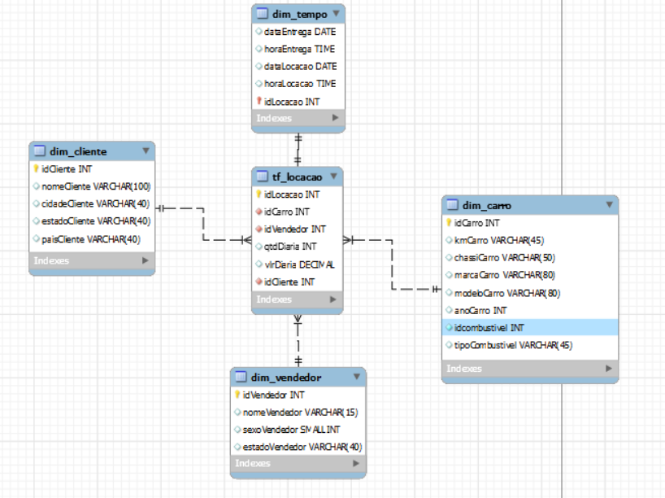

# Etapas


1. A partir da tabela, desenvolver uma modelagem relacional [Etapa I](etapa-1)
    <br>
    Na tabela tb_locacao pode-se perceber que em uma locação sempre vai existir um vendedor, um carro e um cliente na locação. No modelo relacional existe um tipo de relacionamento chamado ternário. 
    <br>
    

    Nesse modelo de relacionamento, a interdependência é fundamental para descrever o fato. Nesse caso a relação é de locação, portando é preciso que exista um vendedor, um cliente e um carro na relação.
    <br>
    Com relação a normalização..

    ### Primeira Forma Normal

    A tabela atende a primeira forma normal, pois não existe nenhum atributo com valor duplicado.

    ### Segunda Forma Normal

    Como já existe um idLocacao e ele é a chave primária da locação, a tabela também está na segunda forma normal.

    ### Terceira Forma Normal

    Aqui se encontram os problemas, pois existem muitos dados que apenas dependem de um ID que é chave estrangeira na tabela, ou seja, é possível de se criar uma tabela separada.
    
    <br>

    

    #### Modelagem relacional (Modelo lógico)


    

    #### Relacionamentos

    O relacionamento ternário, já mencionado. Nesse caso, como já existia um idLocacao, as chaves de tb_cliente,tb_carro e tb_vendedor são estrangeiras e tb_locacao não possui chave composta.

    <br>

    

    <br>

    Nesse relacionamento, um carro pode ter um tipo de combustível, já um tipo de combustível pode estar em vários carros. O idCombustível é chave estrangeira não primária na tabela carro.

    <br>

    

    <br>

    Nesse caso, esse relacionamento poderia ser separado e dados do endereço podiam estar juntos na tabela cliente. Mesmo assim, a preferência por separar veio com o objetivo de tornar mais rápida as consultadas apenas do endereço do cliente. Nessa situação não temos a linha tracejada, temos a linha contínua e isso acontece pois idCliente é chave estrangeira e primária na tabela de endereço.

    <br>


    

    ## Modelagem DIMENSIONAL

    

    <br>

    Como é possível observar, o Star Schema contém as dimensões tempo,cliente,carro e vendedor. A tabela fato diz respeito à locação.

    Em relação a modelagem relacional, alguns atributos foram agrupados em uma só tabela, no caso de cliente e no caso de carro, para facilitar a filtragem e a obtenção dos dados. Em relação da nova tabela dimensão (tempo), foi criada para que haja a filtragem pelo tempo tanto de locação quanto de entrega do veículo.


### MODELAGEM NO SQL

Para separar as tabelas e criar novas, eu utilizei o comando CREATE TABLE e depois inseri dados com SELECT. É importante lembrar que as chaves estrangeiras não podem ser nulas de forma alguma. Outra adversidade foi o caso das datas, que estavam ser formatação.

```SQL

    DATE(
    SUBSTR(CAST(dataLocacao as TEXT), 1, 4) || '-' ||  -- Ano
    SUBSTR(CAST(dataLocacao as TEXT) , 5, 2) || '-' ||  -- Mês
    SUBSTR(CAST(dataLocacao as TEXT), 7, 2)            -- Dia
    )
```

<BR>

Primeiro eu fiz o casting do campo de data para texto, para que ele não ficasse no formato numérico, depois peguei cada parte da String e separei no formato ano-mes-dia. Posteriormente a esses passos, só foi necessário fazer novamente o casting para o tipo DATE.