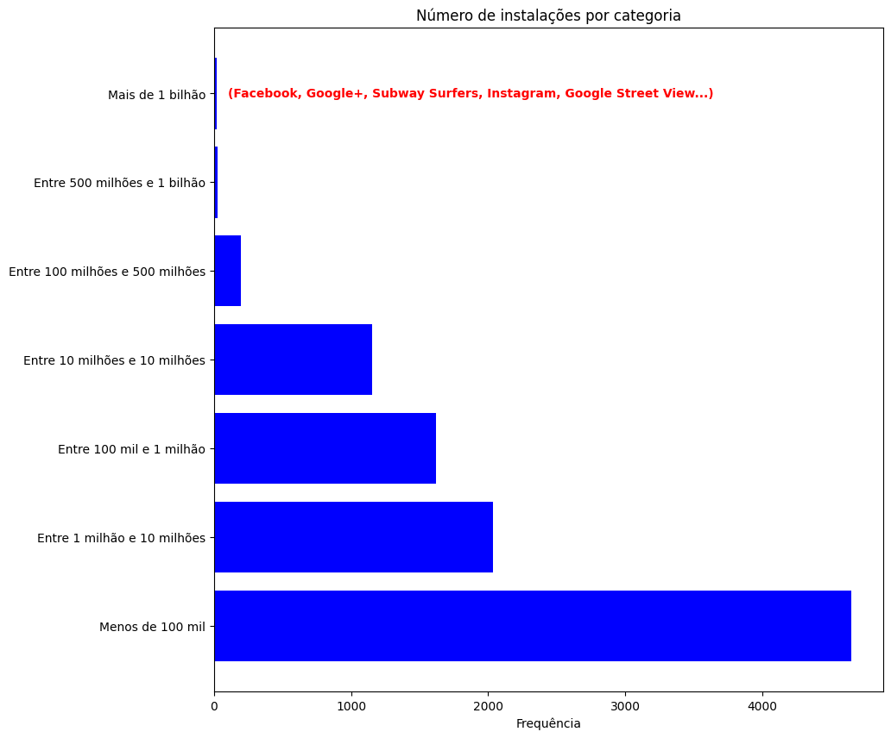
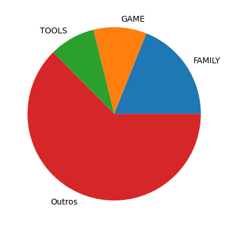
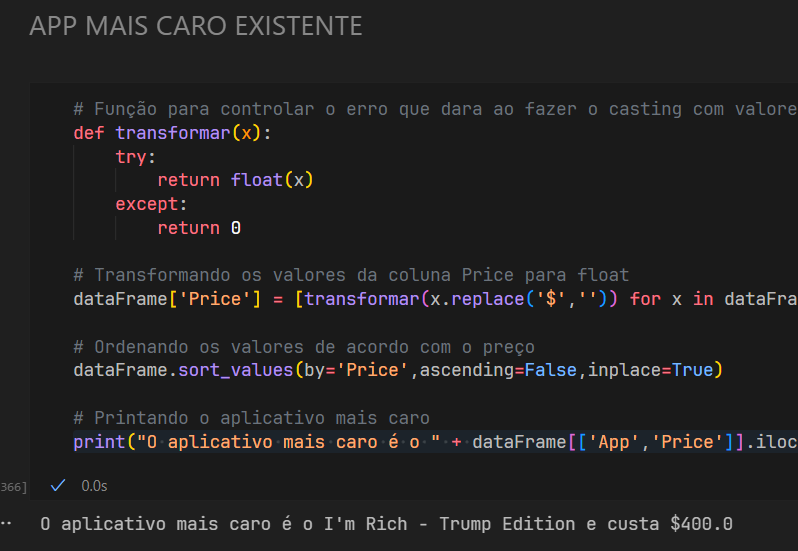
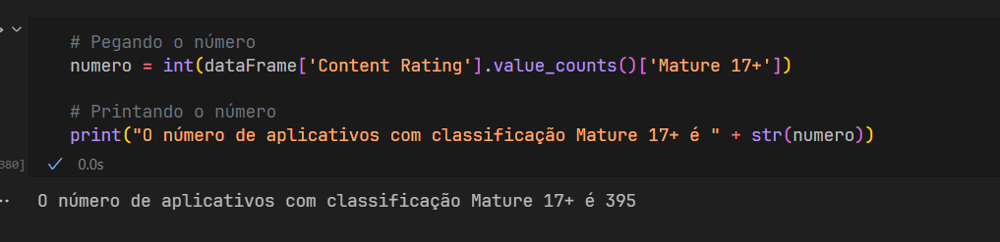
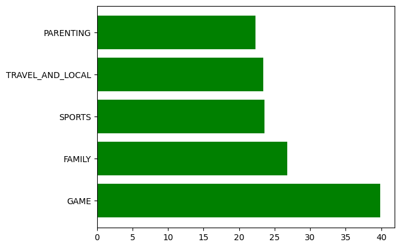
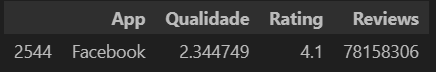

# Etapas (Desenvolvimento)


#### Remova as linhas duplicadas


Escolhi  remover as linhas que possuem o nome de App e data da Ultima Atualização diferente

`dataFrame = dataFrame.drop_duplicates(subset=['App','Last Updated']) `

Existia uma linha com dados uma coluna para esquerda, apenas dei o shift para arrumar

#### Gráfico de barras contendo os top 5 Apps por número de instalação

Nessa questão, acredito que seja impossível realizar um rankeamento dos valores, pois eles estão dados em intervalos, ou seja, cada coluna mostra a que intervalo pertence o App.

Dessa forma, preferi mostrar alguns dos 5 apps dessa categoria junto a um gráfico de barras mostrando a frequência que cada categoria aparece:




#### Faça um gráfico de pizza mostrando as categorias de apps existentes no dataset de acordo com a frequência em que eles aparecem

Nessa questão, por existirem diversas categorias com valores menores (e muito próximos), optei por rotular categorias com valores menores que 800 para "Opcoes".



#### Mostre qual o app mais caro existente no DataSet

Essa questão foi bem tranquila pois consistiu em apenas remover o $, fazer o casting, ordenar os valores e pegar o primeiro.





#### Mostre quantos Apps são classificados como "Mature 17+"

Apenas apliquei a função value_counts sobre Content Rating e peguei sobre valor "Mature 17+"

```
# Pegando o número
numero = int(dataFrame['Content Rating'].value_counts()['Mature 17+'])

# Printando o número
print("O número de aplicativos com classificação Mature 17+ é " + str(numero))

```



#### Top 10 por número de reviews

```
dataFrame['Reviews'] = [int(x) for x in dataFrame['Reviews']] # Fazendo o casting para int

dataFrame.sort_values(by='Reviews',ascending=False,inplace=True) # Ordenando os valores de acordo com as reviews

dataFrame[['App','Reviews']].head(10) # Printando os 5 aplicativos com mais reviews

```

##### Crie pelo menos mais 2 cálculos sobre o dataset e apresente um em formato de lista e outro em formato de valor


##### Top 5 categorias com maior tamanho de aplicativo (em média)

Nessa questão, utilizei uma função para formatar os tamanhos em formato numérico com essa função

```
# Função para nomear cada linha da nova coluna
def transformar(x):
    if('M' in x):
        return float(x.replace('M',''))
    elif('k' in x):
        return float(x.replace('k',''))/1000
    if(x == 'Varies with device'):
        return 0.0
```

Substitui os valores que tinham "Varies with device" pela média dos valores que não estão com zero


```
# Calculando a média dos valores diferentes de 0
media = dataFrame['Size'][dataFrame['Size'] != 0].mean()

# Substituindo os valores 0 pela média
dataFrame['Size'] = [media if x == 0 else x for x in dataFrame['Size']]

```

Depois realizei um "groupby" por categoria, capturei a média e ordenei os valores.




#### O aplicativo com mais de 1 bilhão de instalações mais bem avaliado

Fazendo uma análise dos dados, percebi que tinham 4 aplicativos com o maior rating, dessa forma decidi criar um indicador para avaliar a qualidade dos aplicativos.

O indicador foi feito com uma média ponderada do rating (com peso 7) e número de reviews dividido por 100 milhões (com peso 3).

Esse indicador foi transformado em uma coluna no dataset, que foi ordenado a partir dela, para obter o seguinte resultado.



e construí uma adaptação ao gráfico de dispersão, que possui apenas um eixo para dar o efeito de rankeamento.


