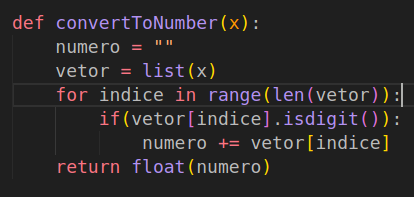
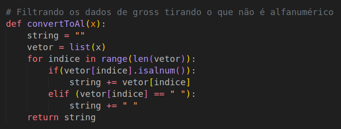
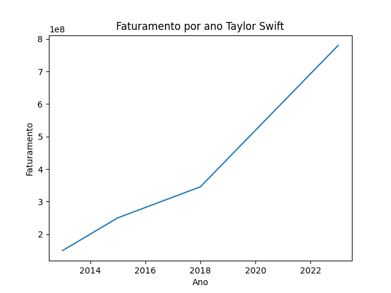
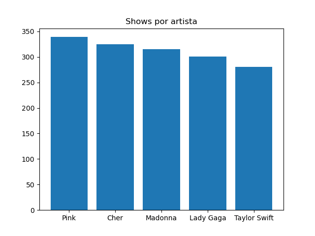

# Etapas 


## Etapa 1 (Fazer o ETL)

[ARQUIVO](./etapa1/)

Nessa etapa, foi necessário fazer a limpeza dos dados que foram dados. Basicamente os problemas principais eram:

- Caracteres especiais
- Caracteres sem sentido depois do escrito 'Tour'
- Números com formatação ',' e com '$'


Eu resolvi o problema dos caracteres estranhos e os números com formação com ',' e com '$' fazendo funções que tiram caracteres que não forem numéricos e, no caso dos caracteres estranhos, que não forem alfanuméricos.





## ETAPA 2 (Fazer a análise de dados)

[ARQUIVO](./etapa2/)

Nessa etapa, foi basicamente fazer uma análise no pandas com os dados.

- Exercício 1: Agrupei pelo artista(método groupby), peguei a média(método mean) do 'Actual gross' e também a contagem dos valores(método count). Depois ordenei esse resultado, primeiro critério foi a contagem e o segundo foi a média do 'Actual gross'. Depois disso, bastou pegar o primeiro valor do DataFrame. 

---

- Exercício 2: Primeiro selecionei as colunas com o mesmo ano de ínicio e fim, depois ordenei pelo 'Average gross' e peguei o primeiro valor. 

```
    resposta2 = dataFrame[dataFrame['Start year'] - dataFrame['End year'] == 0].sort_values(by=["Average gross"], ascending=False).iloc[0][["Tour title","Average gross"]]

```
---

- Exercício 3: Primeiro criei uma coluna que dividia 'Adjusted gross(in 2022 dollars)' pelo número de shows. Depois ordenei e peguei os 3 primeiros da lista.

---

- Exercício 4: Primeiro eu fiz eu agrupei o dataFrame pelo artista(método groupby), depois eu peguei o somatório do "Actual gross"(método sum). Peguei a contagem de valores que cada artista aparece e juntei com o somatório. Depois, apenar ordenei e peguei o primeiro.



---

- Exercício 5: Agrupei por artista(método groupby), fiz o somatório da quantidade de shows(método sum), ordenei e peguei os 5 primeiros



```
resultadoEx5 = dataFrame.groupby("Artist")["Shows"].sum().sort_values(ascending=False).iloc[0:5]

```

# ETAPA 3,4,5 

Nesta etapa, foi feita o preparo e a criação dos containers e o docker-compose para que eles pudessem ser iniciados e trabalhassem juntos.

Olhando para as duas aplicações, claramente a segunda depende do resultado da primeira. Dessa forma, o volume do docker é um bind mount na pasta [volume](./volume/), onde a primeira aplicação cria os dados e a segunda utiliza. No docker-compose a segunda etapa(análise dos dados) é dependente da etapa1(ETL).

OBS: Não achei necessário criar uma pasta requirements.txt, pois são poucos pacotes para instalação no pip

### Etapa 3

```
    FROM python     # Pega a imagem do python

    WORKDIR /app    # Cria um diretório de trabalho chamado /app

    COPY . /app     # Copia todo o conteúdo para dentro do diretório de trabalho

    RUN pip install pandas matplotlib   # Instala o pandas e o matplotlib antes de executar os comandos

    CMD ["python", "etl.py"]    # Executa os comandos

```

### Etapa 4

```

    FROM python     # Pega a imagem do python

    WORKDIR /app    # Cria um diretório de trabalho chamado /app

    COPY job.py /app     # Copia todo o conteúdo para dentro do diretório de trabalho

    RUN pip install pandas matplotlib   # Instala o pandas e o matplotlib antes de executar os comandos

    CMD ["python", "job.py"]    # Executa os comandos

```

### Etapa 5

```

services:
  etapa1:
    build:
      context: ./etapa1  # Pega a pasta correta, onde está o Dockerfile
    volumes:
      - ./volume:/volume # Especifica o volume que será utilizado no bind mount
    
  etapa2:
    depends_on:
      - etapa1  # Cria a dependência com a etapa 1
    build:
      context: ./etapa2 # Pega a pasta correta, onde está o Dockerfile
    volumes:
        - ./volume:/volume # Especifica o volume que será utilizado no bind mount

```


 

