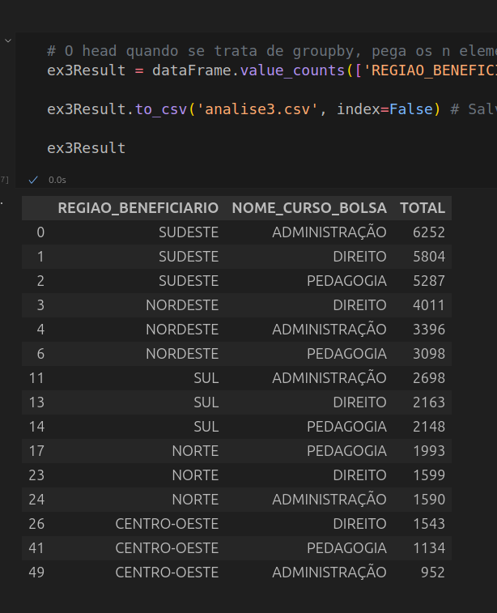

# Etapas 


## Etapa 1 

[ARQUIVOS ETAPA 1](./etapa1/)

##### TAREFAS:

- Fazer uma análise dos dados
- Decidir três questionamentos ou análises para os dados
- Enviar o arquivo para o bucket

### Fazer uma análise dos dados

##### Breve resumo sobre os dados: Os dados escolhidos se referem aos alunos contemplados com a bolsa do PROUNI em 2020, onde cada linha representa a bolsa de cada aluno.

Foi percebido que o DataFrame possui diversas possibilidades de análise, uma vez que possui colunas como data de nascimento(Fator determinante para a escolha dos dados), região do aluno, curso escolhido, raça e sexo.

#### Primeira ideia:

A primeira ideia veio com o objetivo de cumprir o requisito de data, da função de conversão e também da função de string. Percebi que os dados das datas não estavam no formato de data, como pode ser visto na imagem:


O formato de data está no formato de dia, mês, ano. Para converter para o formato de data, será preciso trocar para os dois campos -> **Função de String**

Converter os dados para data-> **Função de conversão**

Criar uma nova coluna categorizando de acordo com o ano -> **Função com condicional**


#### Segunda ideia:

A segunda ideia que tive foi fazer um filtro mais complexo, utilizando dois ou mais operadores lógicos, para cumprir um requisito. A ideia foi: "Qual a quantidade de alunos que estão cursando medicina que não são brancos?".


**Requisitos: Utilizar um filtro com pelo menos dois operadores lógicos**

**Possível Resolução: chamar o dataframe filtrando alunos de medicina(Operador Lógico) e que não são brancos(Operador Lógico)**


#### Terceira ideia:

Para cumprir o requisito de agrupamento, como o Data Frame possui os dados de região e curso, uma boa ideia seria descobrir quais são os cursos mais escolhidos por região. Para isso um value_count com um group by pode ser uma solução boa.


#### Tratar os dados

**É possível percerber que existe uma coluna inútil, uma vez que possui apenas um valor que se repete em todas as linhas. Essa coluna é o ano em que o estudante foi contemplado. Uma vez que o DataFrame já diz que os dados são de 2020, é totalmente desnecessária uma coluna para análise de dados com esse dado em todas as linhas**


**Também é possível descobrir se existem valores nulos nas colunas, com o comando describe:**


**É possível perceber que a coluna "NOME_CURSO_BOLSA" possui dados faltantes**

A solução que pensei ser a melhor foi substituir pela moda.

####  COLOCAR O ARQUIVO NO BUCKET

Para manter as chaves da AWS protegidas, foi criado um arquivo .env. Dessa forma as chaves ficam protegidas e não são colocadas direto no código. Para utilizar o dotenv, foram utilizadas as bibliotecas **dotenv** e **os**.

```
from dotenv import load_dotenv
import os
import boto3

load_dotenv(override=True)  # Carrega as variáveis do arquivo .env
```

Para carregar as variáveis de ambiente no código, foi utilizada a biblioteca os

```
  s3 = boto3.client('s3',
   aws_access_key_id=os.environ.get("AWS_ACCESS_KEY_ID"),
   aws_secret_access_key=os.environ.get("AWS_SECRET_ACCESS_KEY"),
    aws_session_token=os.environ.get("AWS_SECRET_SESSION_TOKEN"),
   region_name=os.environ.get("AWS_REGION")
)

```

Para upar o arquivo foi utilizado o método upload_file:

```
bucket_name = "meu-bucket-unico-gabriel-2025"  # nome globalmente único
region = os.environ.get("AWS_REGION")

try:
    s3.upload_file("ProuniRelatorioDadosAbertos2020.csv", "meu-bucket-dados-prouni", "dadosProuni.csv")
    print(f"Arquivo '{bucket_name}' upado com sucesso!")
except Exception as e:
    print(f"Erro ao upar arquivo: {e}")
```

Execução:


Prova na AWS:


## ETAPA 2

[ARQUIVOS ETAPA 1](./etapa2/)

Na etapa 2, a lógica para comunicar o bucket S3 na AWS foi a mesma que na etapa 1.

Como nesta etapa foi pedido para que o arquivo não fosse baixado e sim utilizado diretamente, a função indicada para esse caso é a **get_object**, que retorna os metadados do arquivo, junto ao seu conteúdo, que pode ser lido gradualmente com a funçao .read().

    response = s3.get_object(Bucket='meu-bucket-dados-prouni', Key='dadosProuni.csv') # Pega os dados sem baixar o conteudo ainda

Na minha execução, o pandas não soube lidar muito bem lendo todos os arquivos e já passando como parâmetro que o csv pudesse ser lido. Para isso, precisei utilizar a biblioteca a IO, que pode simular um arquivo na memória, com ponteiro de leitura e gravação, o que facilita para o pandas. Os bytes lidos no arquivo do bucket foram passados para o método que "simula esse arquivo"

```
conteudo = response['Body'].read()
buffer = io.BytesIO(conteudo) # Simula um arquivo na memória RAM

# Agora pode usar no pandas, com encoding e separador
dataFrame = pd.read_csv(buffer, encoding='windows-1252', sep=';')

```

**Código Funcionando**


### Tratando os dados

Para resolver o problema da coluna desútil, basta dar um drop:

    dataFrame = dataFrame.drop('ANO_CONCESSAO_BOLSA', axis=1)

--- 

Em relação aos valores nulos na coluna de curso, basta substituir utilizando o método .fillna() com a moda dos valores

    dataFrame['NOME_CURSO_BOLSA'] = dataFrame["NOME_CURSO_BOLSA"].fillna(moda)


### Executando o desafio das análises

#### Primeira Análise (função de conversão, função de data, função de string)

--- 
**Funçao de manipulação de STRING**

```
    def fix_data(data):
      nova_data = data[3:5] + '/' + data[0:2] + '/' + data[6:] ## Apenas troca os dados de lugar
      return nova_data
```
---

**Funçao de data e condicional**

```
    def decada(linha):
    ano = linha['DATA_NASCIMENTO'].year # Manipulação de data
    if ano >= 2000:
        return 'Menos de 20 anos'
    elif ano >= 1990:
        return 'Menos de 30 anos'
    elif ano >= 1980:
        return 'Menos de 40 anos'
    else:
        return 'Mais de 40 anos'
```

Essas funções foram utilizadas junto a função apply do pandas, para que fossem aplicadas ao DataSet

Ordem das funções:

- Troca o dia com o mês utilizando a função de fix_data
- Converte utilizando a função to_datetime
- Cria a classificação para a coluna década com a função decada

--- 

Depois do resultado completo, foi feito um gráfico para melhor visualização do problema:


**Comprovação do código rodando**


#### Segunda análise

Para realizar a segunda análise foi apenas realizada uma consulta para pegar os dados do bolsista cadastrado em medicina e não branco.

    nao_sao = dataFrame[(dataFrame['TIPO_BOLSA'] == 'INTEGRAL') & (dataFrame['NOME_CURSO_BOLSA'] == 'MEDICINA') & ~(dataFrame['RACA_BENEFICIARIO'] == 'Branca')].count()[0] 

Com o objetivo de deixar a análise mais clara, a quantidade de bolsistas brancos também foi capturada. Dessa forma foi criado um gráfico de barras para comparação:


**Comprovação do código rodando**


#### Terceira Análise (função de agrupamento)

**Para descobrir os cursos mais populares, basta realizar um value_counts por região e nome do curso, assim a quantidade será descoberta facilmente. No entanto, a parte que pode parecer complicada é o rankeamento, porém quando fazemos o groupby por região e fazemos o head, ele pega os 3 primeiros de cada região, o que torna a resolução do problema mais simples.**

    ex3Result = dataFrame.value_counts(['REGIAO_BENEFICIARIO', 'NOME_CURSO_BOLSA']).reset_index(name='TOTAL').groupby('REGIAO_BENEFICIARIO').head(3)


**Comprovação do código rodando**



## ETAPA 3 (Salvar os arquivos)

Nesta estapa o método upload_file foi utilizado para pegar os arquivos gerados(CSV limpo, resultados das análises) e realizar o upload no bucket.


**Comprovação upar arquivos no bucket**


**Comprovação arquivos no bucket**


