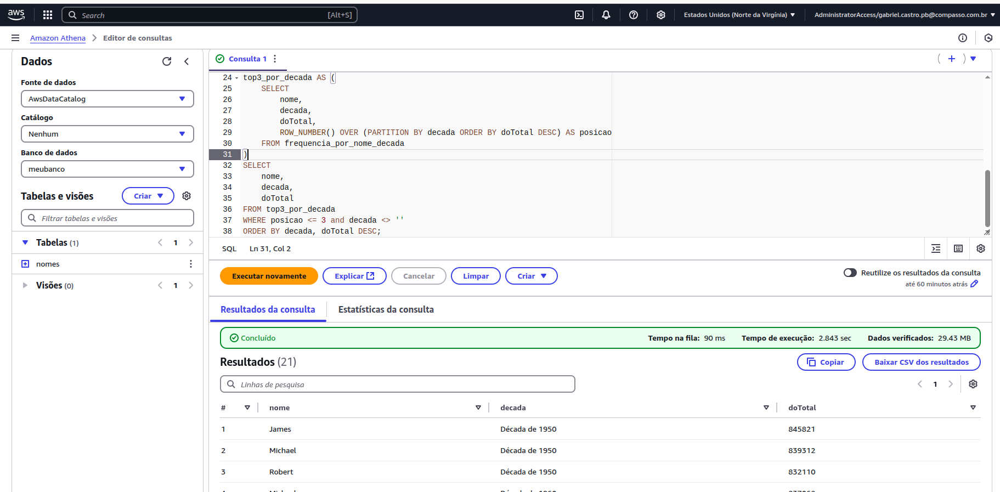
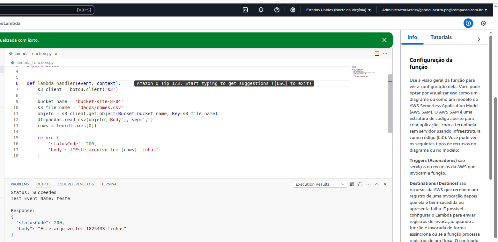

# Resumo (Feedback dos cursos)

**AWS CLOUD QUEST:** Gostei bastante do Cloud Quest, a oportunidade de realizar tarefas na AWS sem correr risco de gerar custo desnecessário é muito boa. Os exercícios são bem pertinentes e importantes. O único ponto negativo do Cloud Quest, em minha opinião, é a forma como são dadas as tarefas, são muitos passos e torna muito cansativo realizar as etapas. Em específico, gostei bastante da parte de redes, onde ele mostra como criar uma VPN, criar subredes e conectar com um gateway de internet. 

**CLOUD ECONIMICS:** Esse curso é bem interessante, pois mostra como a nuvem é capaz de economizar os gastos em diversas áreas e como isso impacta na empresa. Pra mim, foi extremamente importante para que pudesse entender em quais áreas o serviço de nuvem busca melhores soluções, já que não vivenciei problemas com a arquitetura on-premisse. A parte que achei mais interessante foi onde são mostrados os modelos de precificação, possuindo várias possibilidades de acordo com a necessidade do cliente, como as Spot Instaces ou Sob demanda, por exemplo.

**SALES ACREDITATION:** Para mim não foi tão interessante aprender sobre a parte de vendas da AWS, mas entendo perfeitamente o motivo pelo qual isso é necessário. Entender como podemos fazer o cliente acreditar que é possível obter uma melhora em seu custo e sua administração de computação, também nos faz entender melhor o porque a computação em nuvem é indicada. Eu gosto bastante do Framework Cloud Adoption, acho suas ideias bem estruturadas. Também gostei da parte do curso que mostra os serviços-chave da AWS para mostrar ao cliente como ele pode ser beneficiado pelos serviços de computação em nuvem.


# Exercícios


# AWS S3 (Simple Storage Service)

##### OBS: Para que houvesse uma boa comprovação dos resultados e menos redundância nas capturas de tela, cada uma delas tem alguma referência de que estou realizando o procedimento. No bucket criado, é possível ver meu usuário. Nos dados criados, é possível ver tanto o usuário, quanto o nome do bucket que foi criado na etapa anterior. Nas capturas mostrando o funcionamento do bucket, é possível ver a URL com o nome do bucket que criei. Já na comprovação do arquivo sendo baixado, é possível ver que o usuário do computador é congruente com o meu nome.

[Arquivos utilizados](./Exercicios/S3)

Neste exercício foi criado um bucket para armazenamento de um site estático.

1 - Primeiro foi criado o bucket


2 - As configurações de acesso público e de configurar para que o bucket seja para site estático foram adicionadas

3 - Logo em sequência, o HTML foi criado e o caminho para baixar os dados(csv) foi colocado da seguinte forma:

```
  <a href="/dados/nomes.csv">Download CSV File</a> 
```

o href foi colocado dessa maneira para que quando o html estiver no bucket, ele possa procurar pela pasta dados e achar o csv dentro do bucket.

4 - A pasta dados foi criada no bucket e foi feito upload do arquivo csv nela


5- Depois, foi feito o upload do arquivo de erro e foi configurado na AWS.

6 - Acessando o link do bucket, é possível tanto acessar a página do html, quanto baixar o conteúdo. Além disso, é possível ver o arquivo de erro funcionando quando é procurado um arquivo(ou caminho) que não existe dentro do bucket, nesse caso foi procurado "teste".

OBS: Eu estilizei a página de erro com css.


# AWS ATHENA

[Arquivos utilizados](./Exercicios/ATHENA/)

##### Como o arquivo nomes.csv já estava no bucket no local correto, bastou criar a nova pasta queries e configurar o ATHENA.


Para criar a database e a tabela, basicamente foi utilizado o comando oferecido apenas trocando o nome do banco e colocando os campos corretos:

```
CREATE DATABASE meubanco

CREATE EXTERNAL TABLE IF NOT EXISTS meubanco.nomes ( 
    -- DADOS DA TABELA nomes.csv
    nome STRING, 
    sexo CHAR(1), 
    total INT, 
    ano INT
)
ROW FORMAT SERDE 'org.apache.hadoop.hive.serde2.lazy.LazySimpleSerDe'
WITH SERDEPROPERTIES ( 'serialization.format' = ',', 'field.delim' = ','
)
-- LOCAL ONDE OS DADOS ESTÃO LOCALIZADOS
LOCATION 's3://bucket-site-8-04/dados/'
```

Com a opçao do banco criado escolhida:


A consulta teste foi feita:


Após isso, foi criada a query para descobrir os 3 nomes mais populares de cada década.

Para resolução desse exercício, o principal fator foi lembrar e entender as window functions do SQL, que são capazes de numerar as linhas de acordo com a ordem, o que permitiu selecionar apenas os 3 primeiros. Os passos foram os seguintes:
- Primeiro eu fiz um CASE WHEN para categorizar as decadas de acordo com a data de nascimento (SUBQUERY):
    ```
        SELECT 
        nome,
        CASE 
            WHEN ano >= 1950 AND ano < 1960 THEN 'Década de 1950'
            WHEN ano >= 1960 AND ano < 1970 THEN 'Década de 1960'
            WHEN ano >= 1970 AND ano < 1980 THEN 'Década de 1970'
            WHEN ano >= 1980 AND ano < 1990 THEN 'Década de 1980'
            WHEN ano >= 1990 AND ano < 2000 THEN 'Década de 1990'
            WHEN ano >= 2000 AND ano < 2010 THEN 'Década de 2000'
            WHEN ano >= 2010 AND ano < 2020 THEN 'Década de 2010'
            WHEN ano >= 2020 AND ano < 2030 THEN 'Década de 2020'
        END AS decada
        FROM meubanco.nomes
    ```
- Fiz um GROUP BY com nome e categoria para contar quantas vezes cada nome aparecia por categoria (SUBQUERY):
    ```
        SELECT 
            nome,
            decada,
            COUNT(*) AS total
        FROM nomes_com_decada
        GROUP BY nome, decada
    ```
- Utilizei o row_number e fazendo PARTITION BY ordenando, para que pudesse numerar as posições (SUBQUERY):
    ```
        SELECT 
        nome,
        decada,
        total,
        ROW_NUMBER() OVER (PARTITION BY decada ORDER BY total DESC) AS posicao
        FROM frequencia_por_nome_decada
    ```
- Peguei os nomes com numero menor que 3 (Query Principal):
    ```
        SELECT 
        nome,
        decada,
        total
        FROM top3_por_decada
        WHERE posicao <= 3 and decada <> ''
        ORDER BY decada, total DESC;
    ```

##### Executando a query




##### Resultado query


##### OBS: Esse resultado pode ser diferente, pois existem várias pessoas com a mesma quantidade de nomes nesse valor máximo por década, não são somente os três que apareceram que possuem esse valor.


# AWS LAMBDA

##### A função lambda foi criada e foi feito o teste, conforme pedido:


##### O arquivo Dockerfile foi criado e foi dado um build:


##### Indo até a pasta correta:


##### Instalando o pandas:


##### Copiando os dados:


##### Upando o arquivo:


##### Criando a camada:


##### Modificando a configuração para que seja possível a execução:


##### Executando:




# Evidências

[Fotos de Confirmação](./Evidencias)


# DESAFIO

[DESAFIO](./Desafio)