# Etapas 


## Etapa 1 

[ARQUIVOS ETAPA 1](./etapa1/)

##### TAREFAS:

- Ler os 2 arquivos, sem filtrar os dados
- Gravar os dados no s3 utilizando a biblioteca boto3

### Ler os 2 arquivos, sem filtrar

```

df = pd.read_csv("./csv/movies.csv", sep="|")
df2 = pd.read_csv("./csv/series.csv", sep="|")

df.head(5)
df2.head(5)
 
```

### Gravar os dados

- Primeiro foi feito a conexão com a boto3

```
s3 = boto3.client('s3',
   aws_access_key_id= os.getenv('KEY_ID'),
   aws_secret_access_key= os.getenv('ACESS_KEY'),
   aws_session_token= os.getenv('TOKEN'),
   region_name='us-east-1'
)
```

- Depois, os dados foram enviados

```
    s3 = boto3.client('s3',
   aws_access_key_id= os.getenv('KEY_ID'),
   aws_secret_access_key= os.getenv('ACESS_KEY'),
   aws_session_token= os.getenv('TOKEN'),
   region_name='us-east-1'
)

bucket_name = 'data-lake-do-gabriel-castro'
arquivo_local = 'csv/movies.csv'
chave_destino = 'RAW/LOCAL/CSV/Movies/{}/{}/{}/movies.csv'.format(data.year, data.month, data.day)

try:
    print("Enviando arquivo de filmes para o S3...")
    s3.upload_file(arquivo_local, bucket_name, chave_destino)
    print("Arquivo de filmes enviado com sucesso para o S3.")
except Exception as e:
    print("Erro ao enviar o arquivo de filmes para o S3:", e)


bucket_name = 'data-lake-do-gabriel-castro'
arquivo_local = 'csv/series.csv'
chave_destino = 'RAW/LOCAL/CSV/Series/{}/{}/{}/series.csv'.format(data.year, data.month, data.day)


# Enviar o arquivo para o S3
try:
    print("Enviando arquivo de series para o S3...")
    s3.upload_file(arquivo_local, bucket_name, chave_destino)
    print("Arquivo de series enviado com sucesso para o S3.")
except Exception as e:
    print("Erro ao enviar o arquivo de series para o S3:", e)

```

**Comprovação**

###### Criando imagem

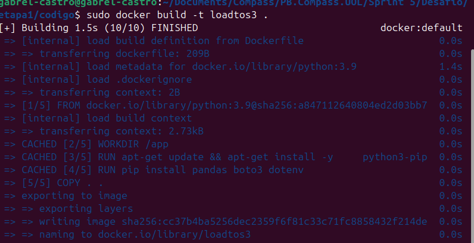

###### Enviando arquivos
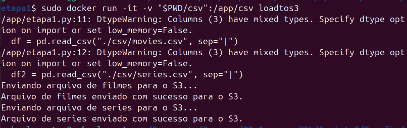


###### Arquivos no S3

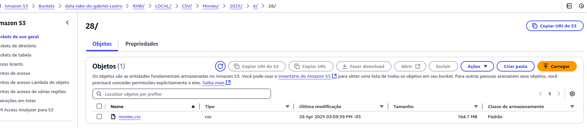


# ETAPA 2

##### TAREFAS:

- Capturar os dados da API DO TMDB
- Identificar quais desses dados já estão no CSV

#### Lambda

Como é pedido para pegar os dados que estão no TMDB através do AWS Lambda, que também irá utilizar o S3 para pegar os dados(csv de séries e filmes).É Preciso:
- Criar o código para pegar os dados do TBMD, compará-los com os do csv e, se forem novos, adicioná-los a um json. **Foi escolhido popular com 5 arquivos com 100 filmes cada.**
- Criar uma LAYER para o Lambda conseguir executar com as Libs necessárias do python
- Dar permissões à função para utilizar o S3

##### Criação do código

Lendo o CSV de filmes carregado anteriormente através do getObject e simulando um arquivo na RAM, com BytesIO, para facilitar a leitura no PANDAS.

O response['Body'] traz apenas metadados do arquivo, já o .read() permite uma leitura gradual ou inteira do conteúdo.

```
s3 = boto3.client('s3')

response = s3.get_object(Bucket='data-lake-do-gabriel-castro', Key='RAW/LOCAL/CSV/Movies/2025/4/26/movies.csv')
conteudo = response['Body'].read()
buffer = io.BytesIO(conteudo)
```

Pegando o id dos gêneros, já que meu SQUAD é filtrado apenas com **Ação e Aventura**.

```
api_key = os.getenv('API_KEY')
url = f"https://api.themoviedb.org/3/genre/movie/list?language=en"

headers = {
    "accept": "application/json",
    "content-type": "application/json",
    "Authorization": "Bearer {}".format(api_key)
}

response = requests.get(url,headers=headers)
data = response.json()

for x in data['genres']:
    if(x['name'] == 'Action'):
        idAction = x['id']
    if(x['name'] == 'Adventure'):
        idAdventure = x['id']
```

**Lógica principal do código para obter os dados**

```
LOOP(REPETE 5 VEZES)
    ENQUANTO LISTA É MENOR QUE 95
        FAZ O REQUEST DOS FILMES
        FOR FILME IN FILMES
            FOR FILME_EXISTENTE IN FILMES_E
                IF(FILME_EXISTENTE == FILME)
                    JA_EXISTE = TRUE
                    BREAK
            IF(NOT JA_EXISTE)
                LISTA.ADD(FILME)
    ARQUIVO_JSON = paraJson(LISTA)
    subirNoS3(ARQUIVO_JSON)
```

**Código**
```
for t in range(5): # 5 arquivos com 100 filmes aproximadamente
    definitivo = [] # Criando uma lista para armazenar os filmes
    while len(definitivo) < 95: # Enquanto a lista não tiver 95 filmes aproximadamente
        url = "https://api.themoviedb.org/3/discover/movie?include_adult=true&include_video=false&page={}&sort_by=revenue.desc&with_genres={}%7C{}".format(str(1+i),idAction, idAdventure)
        response = requests.get(url,headers=headers)
        resultados = response.json()['results']
        for y in resultados: # Para cada filme retornado
            tem = False
            for x in df1['tituloOriginal']:
                if(x == y['original_title']): # Verifica se o filme já existe na lista
                    tem = True
                    break # Se o filme já existe, não adiciona e para o loop procurando ele
            if(tem == False): # Se o filme não existe na lista, adiciona
                definitivo.append(y)
            
        i+=1 # Incrementa o número da página

    json_string = json.dumps(definitivo, ensure_ascii=False) # Converte a lista de filmes para JSON

    s3.put_object(Bucket='data-lake-do-gabriel-castro', Key='RAW/LOCAL/JSON/Movies/{}/{}/{}/json{}.json'.format(datat.year, datat.month, datat.day,t), Body=json_string.encode('utf-8'))

```

**OBS: É IMPORTANTE LEMBRAR QUE FOI CRIADA UMA VARIÁVEL DE AMBIENTE PARA O TOKEN DA API TMDB NO LAMBDA**

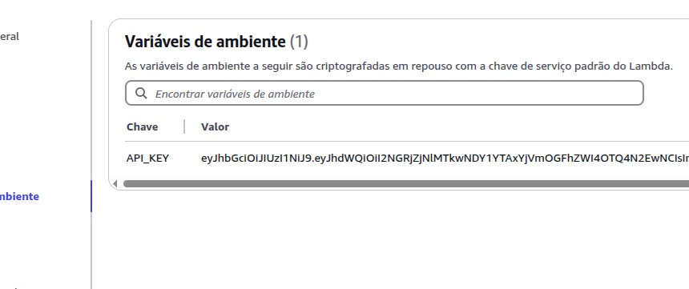

O token foi mostrado parcialmente apenas para mostrar que de fato é o token, porém com a falta de informações, é extremamente difícil descobrir a parte faltante, por isso foi mostrado.


##### Criação do layer

Primeiro, é necessário criar um arquivo zip com as libs instaladas de acordo com o ambiente que o Lambda usa. Para isso:

###### Criação de um Dockerfile

```
FROM amazonlinux:2023
RUN yum update -y
RUN yum install -y \
python3-pip \
zip
RUN yum -y clean all

```

###### Build e execução da instalação das libs

- Dando build no Dockerfile
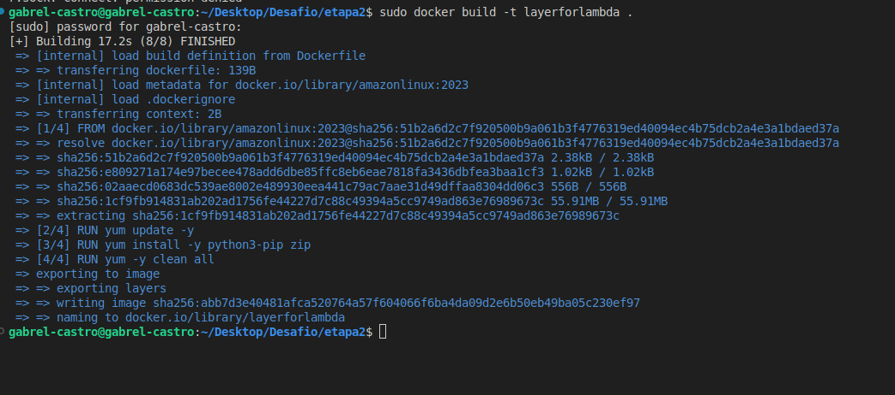

- Instalando as bibliotecas necessária após o run do container
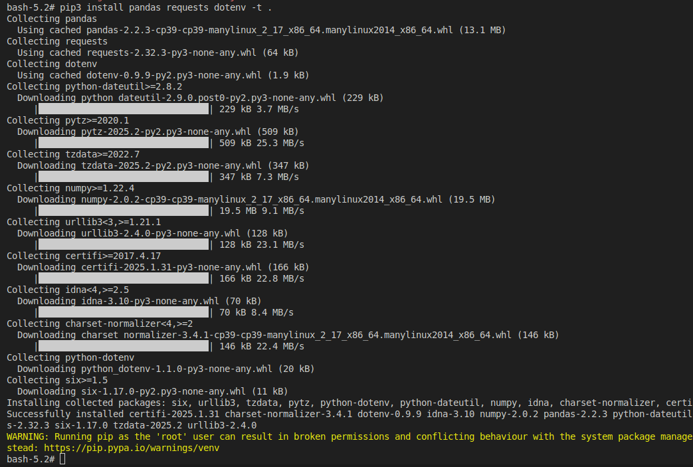
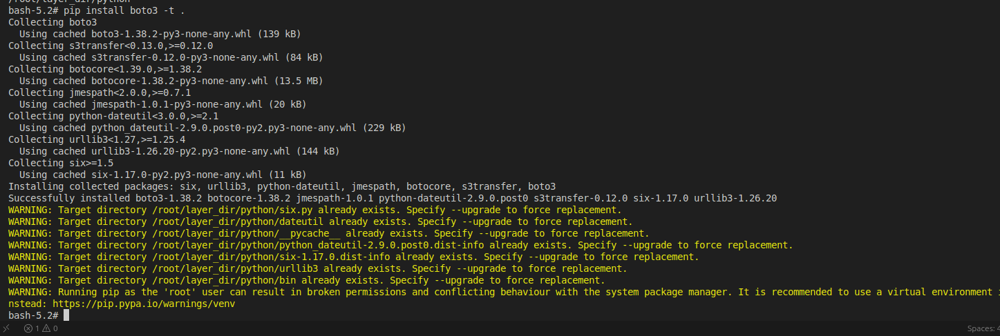
- Depois de "zipado" o arquivo foi copiado para fora do container
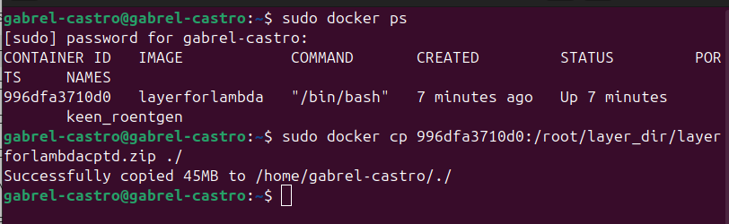


##### Criação da função da AWS

- Colando o código na função
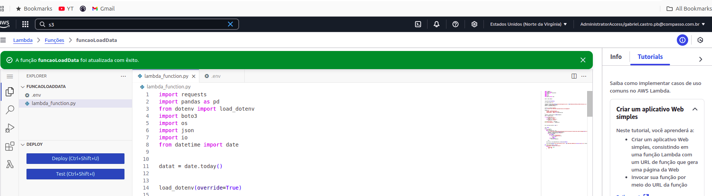

- Criando a camada e upando o arquivo zip


- Camada Criada
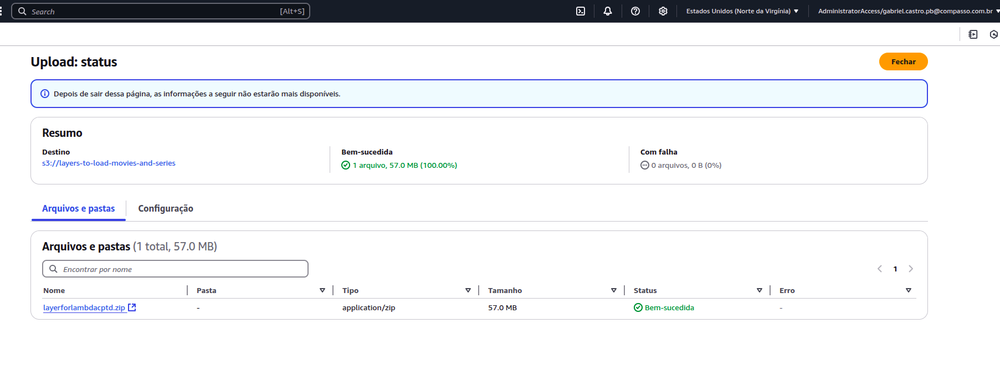

- Colocando camada na função
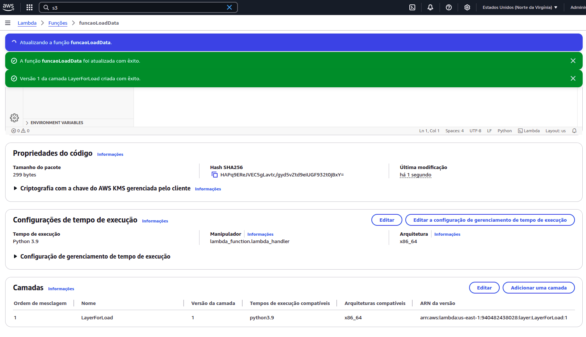


##### Dando permissão para usar o S3

- Seção de permissões
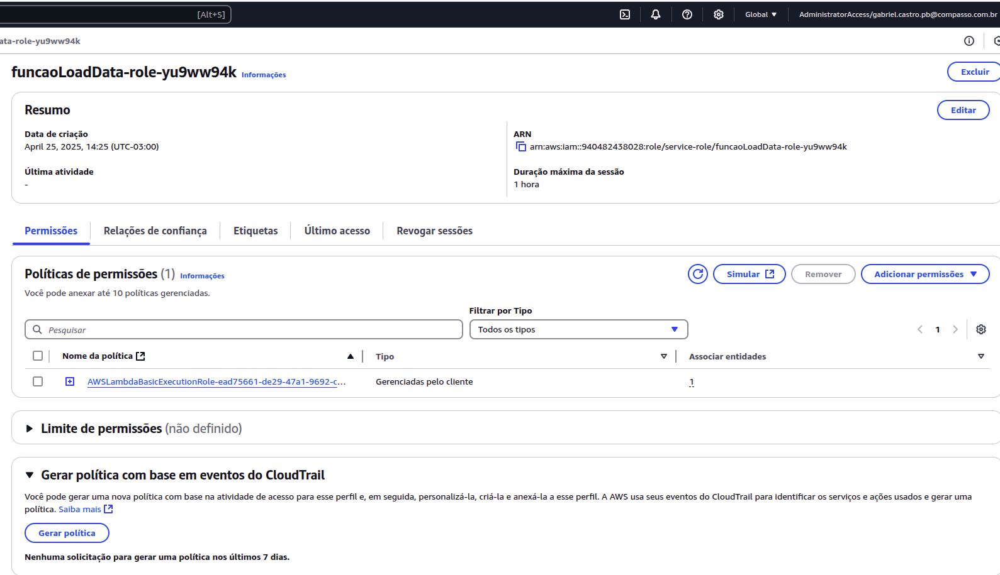


- Adicionando política
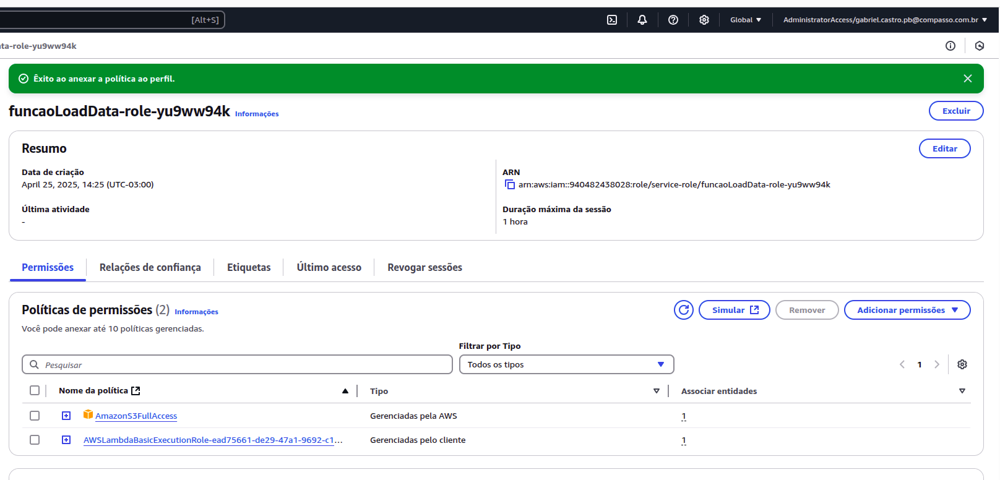


##### Executando

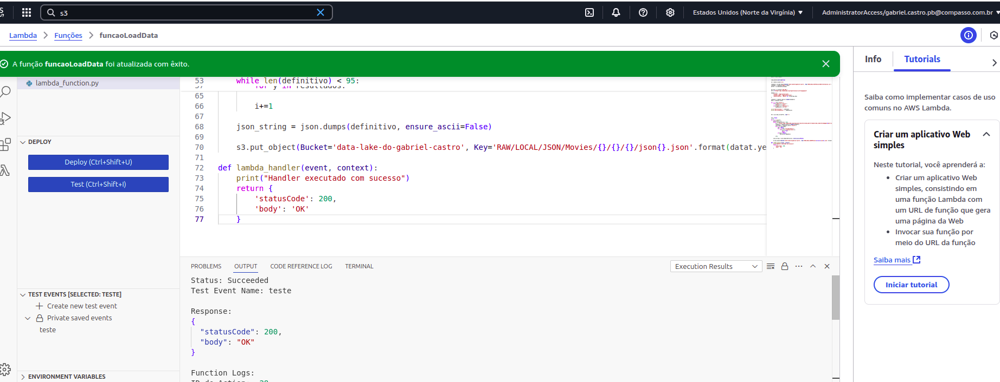

#### Arquivos resultantes no S3

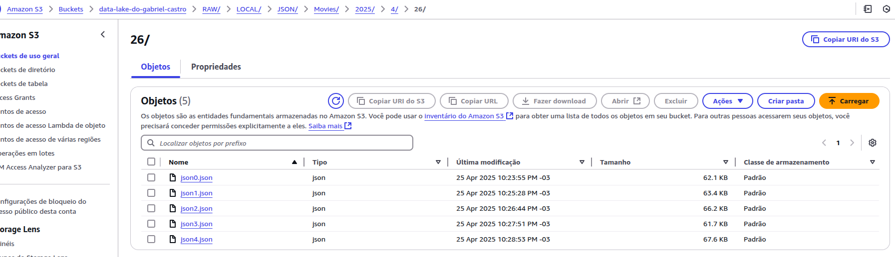

**Conteúdo de um dos arquivos**

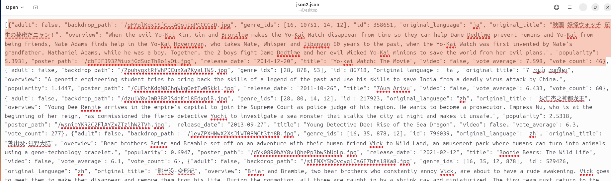

As linhas selecionadas representam um dos filmes adicionados, **mostrando sucesso no load dos dados**.


## Perguntas a serem respondidas

1- Existe uma relação entre os filmes possuirem conteudo adulto e sua nota?

2- Quais são os filmes com maior quantidade de votos?

3- Quais são os 5 filmes mais bem avaliados?

4- A relação entre o tamanho do título e a popularidade do filme

5- Qual o filme mais bem avaliado e que tenha a maior média de votos.
