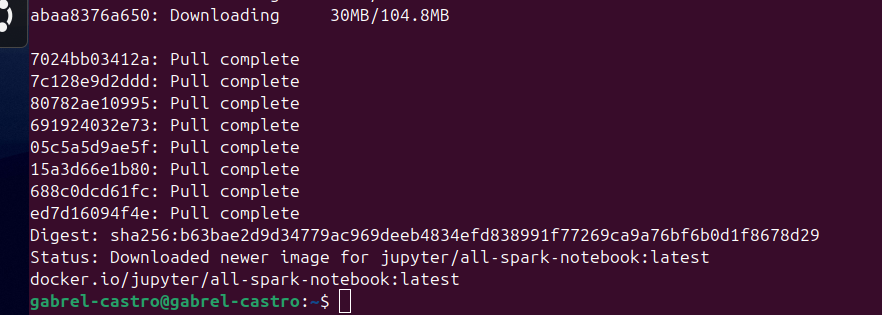
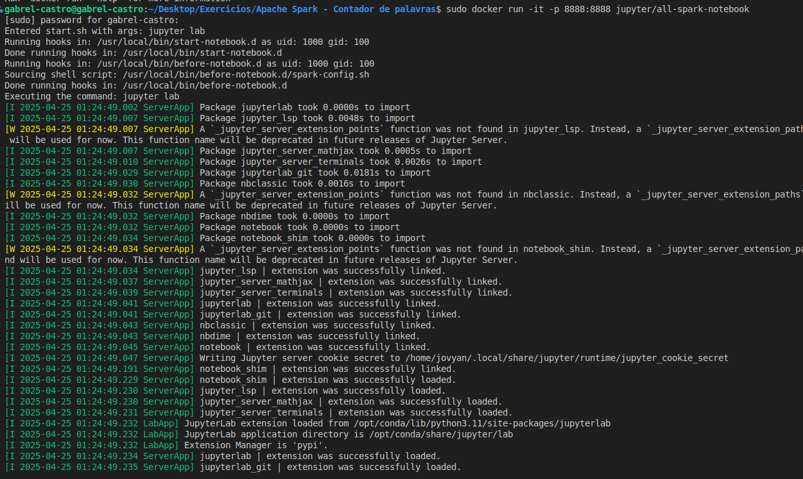
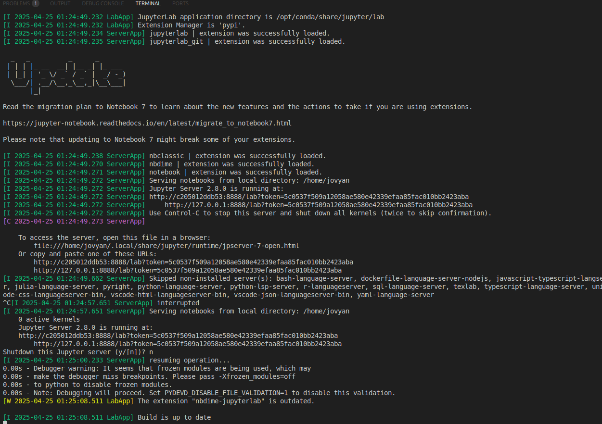
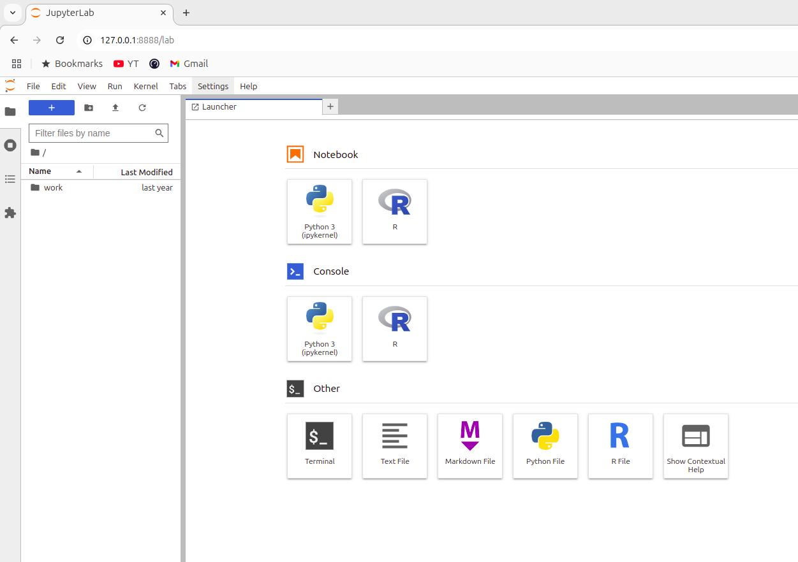
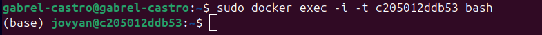
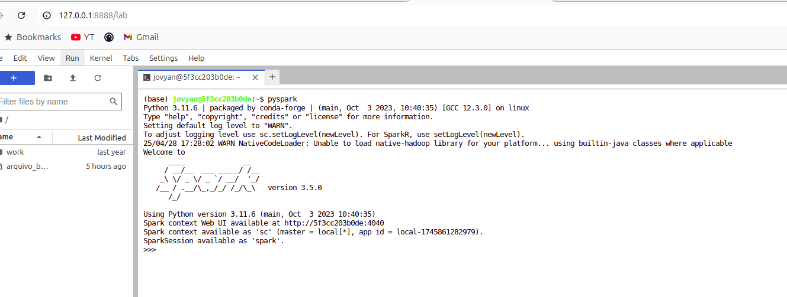
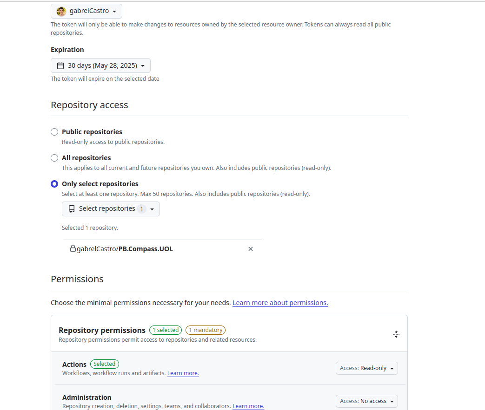
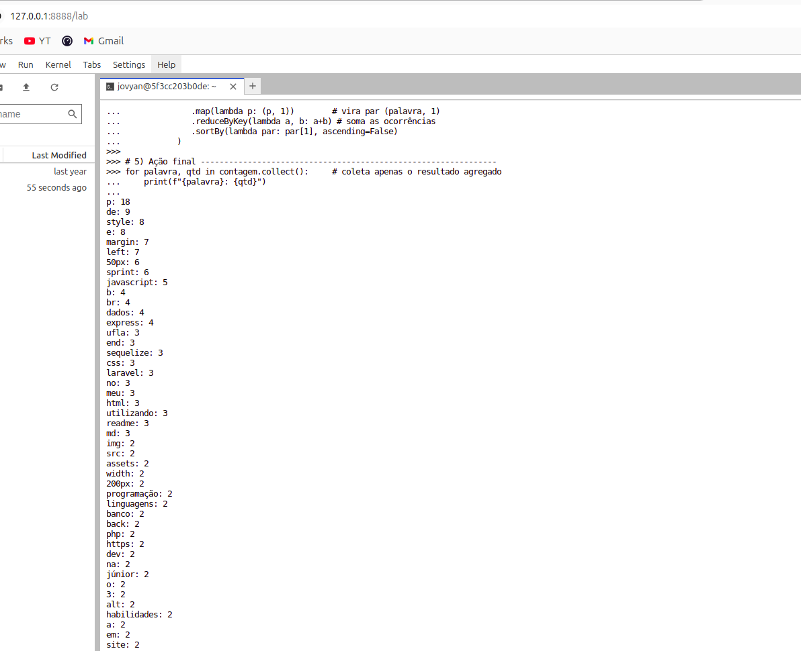
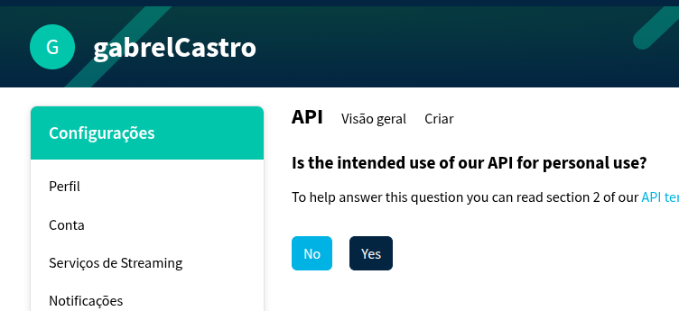
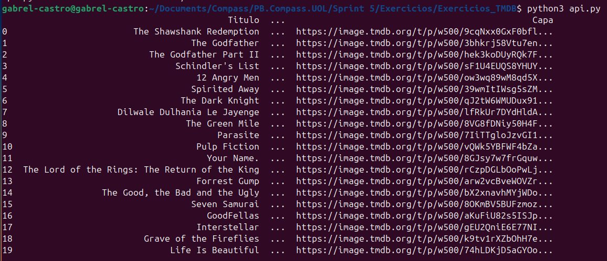

# Resumo (Feedback dos cursos)

**Fundamentals of Analytics:** Esse curso foi bastante importante para mim em razão ao fato de que ele reforça conteúdos já aprendidos, como ETL, por exemplo. Além disso, ferramentas extremamente úteis e suas formas de uso são apresentadas de forma bem clara, como o uso do Glue, ferramenta para limpar e normalizar os dados para prepará-los para análise, em conjunto com outros serviços da AWS. Aprender sobre os 5 V's(Volume, Variedade, Velocidade, Veracidade e Valor) e como a AWS ajuda a garantí-los, e explicar como esse processo é feito, foi essencial.

**Introduction to Amazon Athena:** Apesar do Amazon Athena já ter sido apresentado em outras Sprints, esse curso foi bastante importante para relembrar conceitos e mostrar novas possibilidades do Amazon Athena. Para mim, o curso como um todo, por mostrar desde a criação do s3 para armazenar dados e logs até o acesso ao histórico de query, é bastante importante.

**Serverless Analytics:** Para mim, esse curso não foi tão didático. Levando em consideração tanto aulas da AWS dessa sprint, quanto das sprints passadas. Além disso, para mim e outros bolsista que conversei, a legenda em português do curso não está funcionando. Apesar disso, o curso oferece conteúdo relevante, mostrando como é possível utilizar o Amazon QuickSight.


# Exercícios


# Apache Spark (Contador de palavras)

##### OBS: Para que houvesse uma boa comprovação dos resultados e menos redundância nas capturas de tela, cada uma delas tem alguma referência de que estou realizando o procedimento. Nas telas do console, geralmente é possível ver meu usuário. Nas telas de terminal, é possível ver meu usuário do computador. 

[Arquivos utilizados](./Exercicios/ApacheSpark_Contador_de_palavras/)


#### Primeiro foi feito o pull da imagem na máquina



#### Criando um container a partir da imagem, com um comando no terminal




        sudo docker run -it -p 8888:8888 jupyter/all-spark-notebook

- O comando -it para já abrir o terminal e o -p para poder fazer o tunelamento das portas(8888 do container para 8888 do sistema operacional da máquina)


#### Entrando na página web do servidor web que o spark gera:




É possível notar que o tunelamento funcionou corretamente, umas vez que o container está enviando os dados de sua porta 8888 para a porta 8888 do S0, de acordo com a URL.


#### Conectando ao terminal



**Com o objetivo de ficar mais visível, foi escolhido utilizar o terminal pela interface provida pelo Jupyter**





O código se baseou em conceitos de extrema importância do Spark

```
# 4) Pipeline RDD -------------------------------------------------------------
contagem = (
              sc.textFile(ARQUIVO_FONTE)     # lê o arquivo em N partições
              .flatMap(quebrar_em_palavras) # quebra cada linha em palavras
              .filter(lambda p: p)          # remove vazios (evita '' gerado pelo split)
              .map(lambda p: (p, 1))        # vira par (palavra, 1)
              .reduceByKey(lambda a, b: a+b) # soma as ocorrências
              .sortBy(lambda par: par[1], ascending=False)
           )
```

Além disso, para pegar os dados do README, foi utilizado um token gerado pelo GitHub



No código, bastou fazer a requisição...

        resposta = requests.get(url, headers=headers)

- header com o token
- Url com o README do repositório


O resultado do código, como mostrado acima, teve como seus primeiros resultados: 

```
p: 18
de: 9
style: 8
e: 8
margin: 7
left: 7
50px: 6
sprint: 6
javascript: 5
b: 4
br: 4
dados: 4
express: 4
ufla: 3
end: 3
sequelize: 3

```

OBS: Alguns deles se referem à tags que foram colocadas no README, como 'p' por exemplo.





# TMDB

[Arquivos utilizados](./Exercicios/Exercicios_TMDB/)

#### Conta no TMDB criada



#### Realizando a requisição




# Evidências

[Fotos de Confirmação](./Evidencias)


# DESAFIO

[DESAFIO](./Desafio)