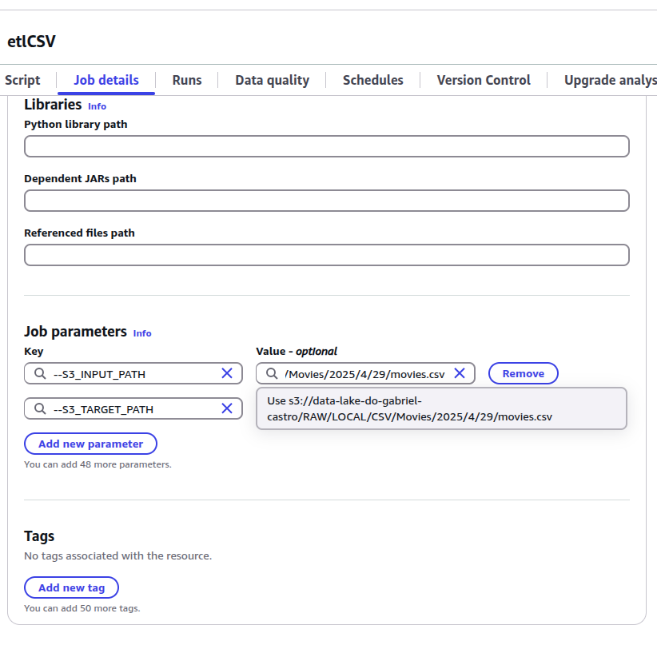
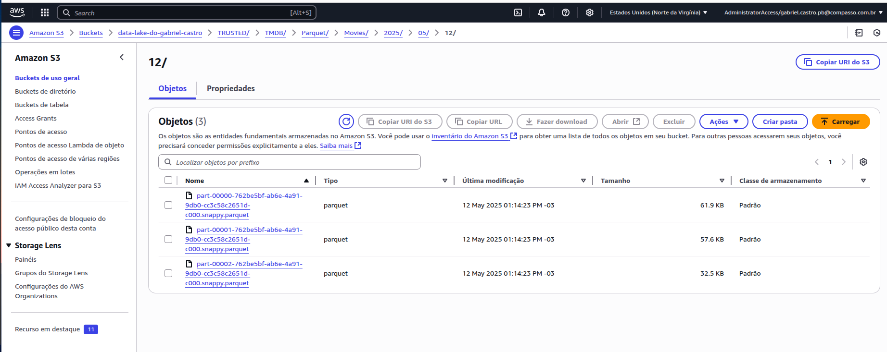

O desafio consistia basicamente na realização de uma transformação e e carregamento dos dados, que foram pegados da API do TMDB e de um CSV on-premisse. Essa tarefa deveria ser feita utilizando o AWS Glue.

O fluxo de ações foi, basicamente:

1. <b>Executar a transformação localmente</b> utilizando um container docker jupyterlab com spark.
2. <b>Criar uma função no IAM</b> para execução do Job no Glue(nesse caso foi reaproveitada a do Laboratório).
3. <b>Criar e configurar um job</b> para execução do código.
4. <b>Executar o job e verificar S3</b> com o objetivo de descobrir se os dados foram de fato gravados. 
5. <b>Criar e dar "Run" no Crawler</b> para que os dados sejam possíveis de serem utilizados no Athena, através do Glue Data Catalog.
6. <b>Acessar dados pelo Athena</b> com o objetivo de descobrir se os dados foram colocados corretamente.


#### 1. Executar Transformações Localmente

##### CSV

Dando um build com o [Arquivo Dockerfile](./etapa_csv/Dockerfile) para utilizar os dados do csv e modificá-los localmente.


Iniciando jupyterlab


Acessando e modificando através da porta 8888 do máquina.


Foi percebido que o arquivo .csv tinham várias linhas que estavam com o mesmo filme, devido ao banco de dados não estar normalizado. O motivo dos filmes estarem aparecendo muitas vezes era em razão a cada linha representar um dos atores/atrizes do filme.

Como na minha análise, que já foi escolhida na Sprint passada, não terá nada com atores e atrizes, as linhas duplicadas foram removidas.

        df = df.dropDuplicates(["tituloPincipal", "anoLancamento"]) # Removendo filmes duplicados por conta dos atores

A questão do gênero será explorada na minha análise, portanto decidi filtrar para que só os gêneros de meu interesse aparecessem na coluna de genêro, isto é, remover os outros gêneros da String.

```
    df = df.withColumn( 
        "genero_new", # Nova coluna com os generos colocados de forma correta
        when(
            (col("genero").isNotNull()) &
            (col("genero").contains("Action")) &
            (col("genero").contains("Adventure")), # Se o genero contiver Action e Adventure
            lit("Action and Adventure") # A coluna nova vai ser Action and Adventure
        ).when(
            (col("genero").isNotNull()) & (col("genero").contains("Adventure")), # Se o genero contiver apenas Adventure
            lit("Adventure") # A coluna nova vai ser Adventure
        ).when(
            (col("genero").isNotNull()) & (col("genero").contains("Action")), # Se o genero contiver apenas Action
            lit("Action") # A coluna nova vai ser Action
        ).otherwise(lit(None)) # Se não contiver nenhum dos dois, a coluna nova vai ser None
    )

    # Tira a coluna genero e troca por genero_new
    df = df.filter(col("genero_new").isNotNull()) \
           .drop("genero") \
           .withColumnRenamed("genero_new", "genero")
```


##### JSON

Dando um build com o [Arquivo Dockerfile](./etapa_json/Dockerfile) para utilizar os dados do json e modificá-los localmente.


Foi utilizada uma amostra de 100 filmes, representando um arquivo json para realização da transformação local.


No caso do arquivo JSON, foi escolhido remover colunas inúteis, como: 

        df = df.drop("backdrop_path") # Removendo coluna desnecessária

Também foi escolhido padronizar as colunas de gênero de forma igual ao CSV.

```
df = df.withColumn(
        "genero_new",
        when(
            (col("genre_ids").isNotNull()) &
            array_contains(col("genre_ids"), idAcao) &
            array_contains(col("genre_ids"), idAventura), # Se o genero contiver Action e Adventure
            lit("Action and Adventure") # A coluna nova vai ser Action and Adventure
        ).when(
            (col("genre_ids").isNotNull()) & array_contains(col("genre_ids"), idAventura), # Se o genero contiver apenas Adventure
            lit("Adventure") # A coluna nova vai ser Adventure
        ).when(
            (col("genre_ids").isNotNull()) & array_contains(col("genre_ids"), idAcao), # Se o genero contiver apenas Action
            lit("Action") # A coluna nova vai ser Action
        ).otherwise(lit(None)) # Se não contiver nenhum dos dois, a coluna nova vai ser None
    )

    # Tira a coluna genre_ids e troca por genero_new
    df = df.filter(col("genero_new").isNotNull()) \
           .drop("genre_ids") \
           .withColumnRenamed("genero_new", "genero")

```

#### 2. Criar uma função no IAM

Permissões dadas


Política de controle específica para um bucket.


#### 3,4. Criar, configurar e executar um JOB

##### CSV

O job foi criado e configurado com as seguintes informações:




Informando o INPUT_PATH como o local do S3 com o arquivo csv e o TARGET_PATH o local do S3 direcionado para a TRUSTED ZONE.

<b>Iniciando o JOB</b>


<b>Resultado do JOB</b>


<b>Conferindo os arquivos no Bucket do S3 da TRUSTED ZONE</b>


##### JSON

O job foi criado e configurado com as seguintes informações:


Informando o INPUT_PATH como o local do S3 com os arquivos JSON e o TARGET_PATH o local do S3 direcionado para a TRUSTED ZONE.

<b>Iniciando o JOB</b>


<b>Resultado do JOB</b>


<b>Conferindo os arquivos no Bucket do S3 da TRUSTED ZONE</b>



#### 5. Criar e dar "Run" no Crawler

Crawler criado com as seguintes configurações:


Execução executada com sucesso do Crawler


Veficando tabelas na database:


#### 6. Acessar dados pelo Athena

Depois que os dados foram transformados com sucesso e carregados na trusted zone, com o crawler executado e, por conseguinte, os dados no Glue Data Catalog, é possível consultá-los através do AWS Athena.


##### Dados com fonte on-premisse


##### Dados com fonte API TMDB


# Resumo do Desafio

