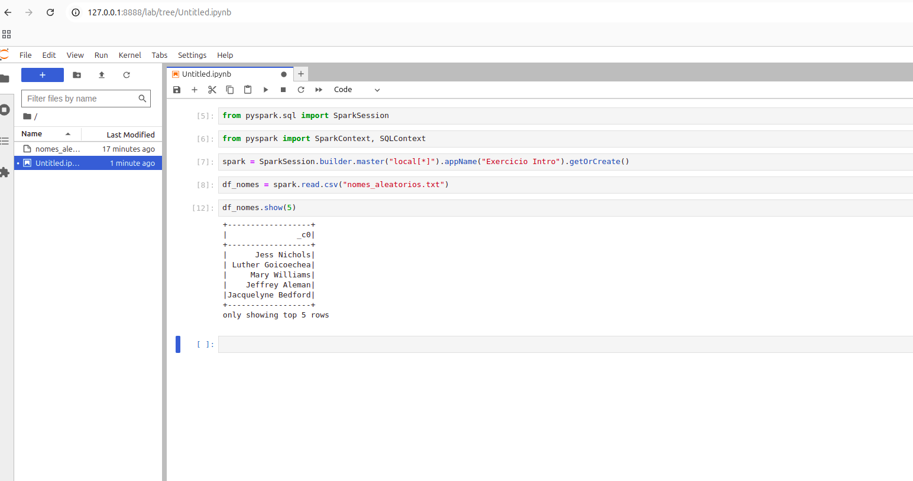
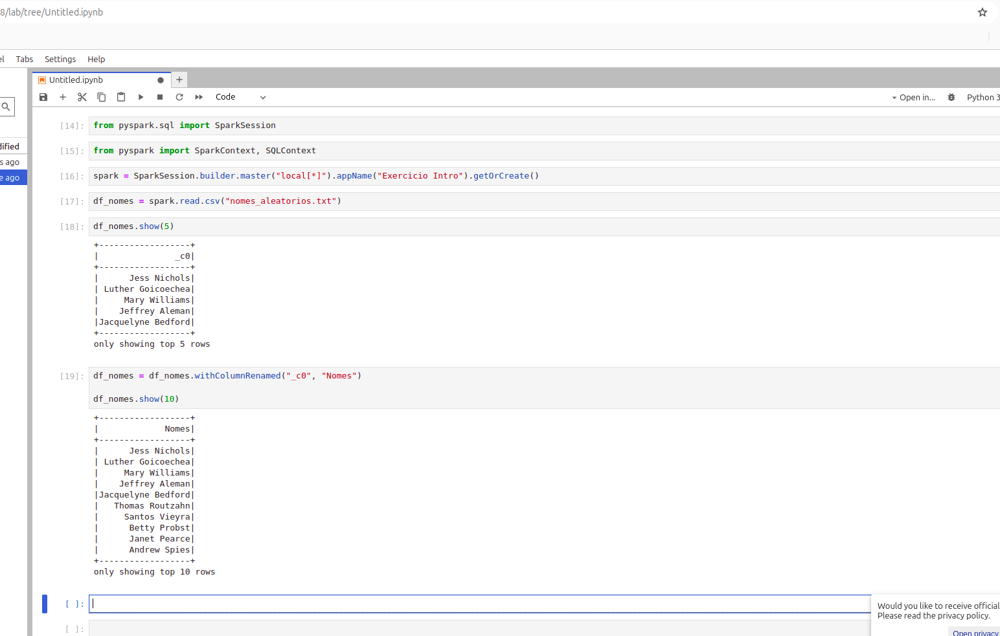
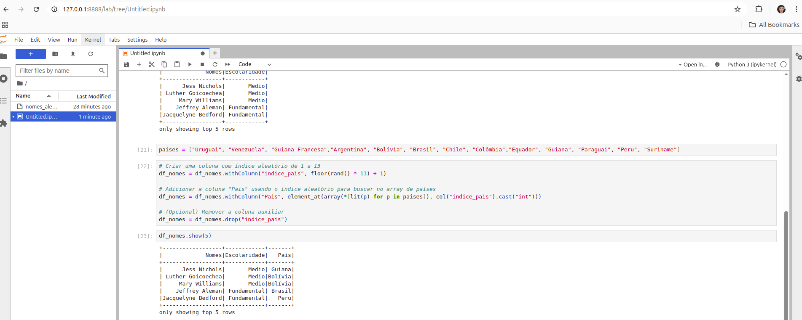
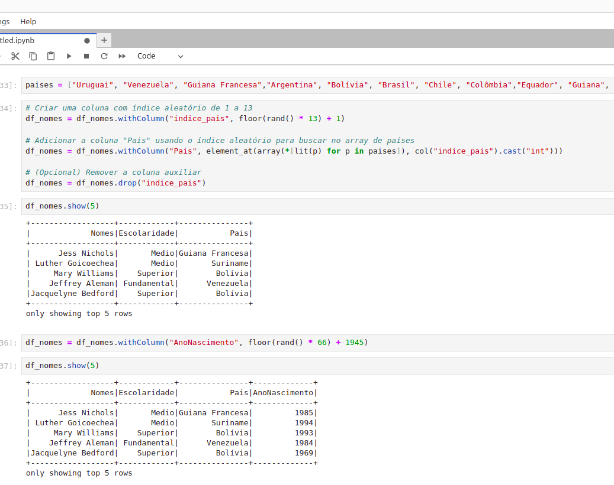

# Resumo (Feedback dos cursos)

**Fundamentals of Analytics - Part 2**: Esse curso foi fundamental para que eu pudesse relembrar os conceitos de ETL. Ainda estava na dúvida com relação ao entendimento entre a dirença entre Data WareHouse e DataLake, e o curso me ajudou de forma grandiosa a entender os conceitos. Para mim essa foi a informação principal do curso, Data Warehouse contêm dados prontos para análise e possuem resposta rápida, já o Data Lake possui dados brutos que precisam de refinamento. 

**AWS Glue Getting Started**: Esse curso foi fundamental para a realização do desafio da Sprint 6, informando de maneira bem didática como funciona o AWS Glue e como funciona seu fluxo de funcionamento em colaboração com outras ferramentas, como o S3.

**AWS - Tutoriais Técnicos - Analytics**: Juntando ao curso de Glue dentro da plataforma da AWS, mencionado anteriormente, foi essencial para a realização da Sprint 6, mostrando o fluxo de funcionamento de um ETL utilizando o Glue.


# Exercícios

<b> OBS: Para comprovar os resultados e evitar redundância nas capturas de tela, cada imagem contém algum indício de que sou eu quem está executando o procedimento. Nas telas do terminal, vê-se o usuário do meu sistema operacional. </b>


## Parte 1 - Geração  e massa de dados

### Etapa 1
[Arquivos utilizados](./Exercicios/Parte%201/etapa1/)

Gerando uma lista com 250 inteiros e aplicando metodo reverse:

```
import random

lista_numeros_aleatorios = []

lista_numeros_aleatorios = [random.randint(1, 100) for _ in range(250)] # 250 inteiros de 1 a 100

lista_numeros_aleatorios.reverse() # Método reverse

print("Lista de números aleatorios:")
for numero in lista_numeros_aleatorios:
    print(numero, end=", ")

```

### Etapa 2

[Arquivos utilizados](./Exercicios/Parte%201/etapa2/)

Escrevendo nomes de animais em arquivo:

```
lista = ["Cachorro", "Gato", "Elefante", "Leão", "Cavalo", "Raposa","Tigre","Urso", "Girafa", "Zebra","Minhoca","Arara","Jacaré","Tucano","Panda","Coala","Canguru","Ornitorrinco","Bicho-preguiça","Tamanduá"] # lista com animais


lista.sort(reverse=True)

for animal in lista:
    print(animal, end=", ")
print("\n")

with open("animais.txt", "w") as arquivo:
    for animal in lista:
        arquivo.write(animal + "\n") # Escrevendo no arquivo
```

### Etapa 3

[](./Exercicios/Parte%201/etapa3/)

Gerando nomes aleatórios:

```
import names,os,time,random

random.seed(40)

qtd_nomes_unicos = 39080

qtd_nomes_aleatorios = 10000000

aux=[]

aux = [names.get_full_name() for _ in range(qtd_nomes_unicos)] # list comprehension para gerar os numeros pela quantidade utilizando a biblioteca

print("Gerando {} nomes aleatórios...".format(qtd_nomes_aleatorios))

dados=[]

dados = random.choices(aux, k=qtd_nomes_aleatorios)

with open("nomes_aleatorios.txt", "w") as f:
    for i in range(qtd_nomes_aleatorios):
        f.write(dados[i] + "\n")
```


## Parte 2 - Apache Spark

[Arquivos da Parte 2](./Exercicios/Parte%202/)

<b>Os resultados de cada etapa desse exercício está no arquivo ipynb:</b> 

[Arquivo ipynb](./Exercicios/Parte%202/EXPT2.ipynb)

### Etapa 1

Como esse exercício necessita do Apache Spark, foi utilizado um container do Jupiterlab com Spark para executar o exercício, através desse [Dockerfile](./Exercicios/Parte%202/Dockerfile).

Lendo o arquivo:

        df_nomes = spark.read.csv("nomes_aleatorios.txt")



### Etapa 2

Alterando nome da coluna:



### Etapa 3

Criando nova coluna e adicionando valores:


### Etapa 4

Adicionando coluna país:



### Etapa 5

Adicionando Ano:




### Etapa 6

Pessoas que nasceram neste século:

```
df_select = (
    df_nomes               # DataFrame original
      .select("*")         # mantem todas as colunas
      .where(col("AnoNascimento") >= 2001)
)

# Mostra 10 nomes do novo DataFrame
df_select.select("Nomes").show(10, truncate=False)

```

### Etapa 7

Pessoas que nasceram neste século(Usando SQL):

```
# 1) Registrar o DataFrame como visão temporária
df_nomes.createOrReplaceTempView("pessoas")

# 2) Consultar via SQL as pessoas nascidas no século XXI
df_select = spark.sql("""
    SELECT *
    FROM   pessoas
    WHERE  AnoNascimento >= 2001  
""")

# 3) Exibir 10 nomes para conferir
df_select.select("Nomes").show(10, truncate=False)
```

### Etapa 8

Pessoas que são da geração Millennials:

```
# Millennials: 1980 ≤ AnoNascimento ≤ 1994
millennials_count = (
    df_nomes
      .filter((col("AnoNascimento") >= 1980) & (col("AnoNascimento") <= 1994))
      .count()
)

print(f"Total de pessoas da geração Millennials: {millennials_count}")
```

### Etapa 9

Pessoas que são da geração Millennials(Usando SQL):

```
# registrar visão temporária se ainda não existir
df_nomes.createOrReplaceTempView("pessoas")

millennials_sql = spark.sql("""
    SELECT COUNT(*) AS qtd_millennials
    FROM   pessoas
    WHERE  AnoNascimento BETWEEN 1980 AND 1994
""")

millennials_sql.show()
```

### Etapa 10

A criação de uma coluna mostrando a geração de cada pessoa pode ser facilmente criada utilizando "CASE WHEN", o "IF ELSE" do SQL. Para gerar a quantidade de pessoas de CADA país, para CADA uma das gerações, basicamente é um GROUP BY que selecione essas duas ao mesmo tempo.

```

geracoes_por_pais = spark.sql("""
    SELECT
        Pais,
        CASE
            WHEN AnoNascimento BETWEEN 1944 AND 1964 THEN 'Baby Boomers'
            WHEN AnoNascimento BETWEEN 1965 AND 1979 THEN 'Geração X'
            WHEN AnoNascimento BETWEEN 1980 AND 1994 THEN 'Millennials'
            WHEN AnoNascimento BETWEEN 1995 AND 2015 THEN 'Geração Z'
        END AS Geracao,
        COUNT(*) AS Quantidade
    FROM   pessoas
    GROUP BY Pais, Geracao
    ORDER BY Pais, Geracao, Quantidade
""")

# exibe o resultado e deixa em DataFrame para uso posterior
geracoes_por_pais.show(truncate=False)

```

# Laboratório AWS Glue

#### Criar e colocar o arquivo no bucket 


#### Criando o IAM Role para os jobs


#### Configurando conta


##### Selecionando role


##### Escolhendo Bucket


##### Definindo permissão padrão


#### Criando database


#### Criando JOB


#### Alterando configuração


#### Código

[Código](./Laboratorio%20AWS/codigo.py)

<b>Detalhe importantes no código:</b>

---

```
df.write.mode("overwrite") \
    .format("json") \
    .partitionBy("sexo", "ano") \
    .save(args['S3_TARGET_PATH'])
```
Esse código faz com que cada linha, cada registro seja um arquivo json que será divido em pastas conforme seu sexo e ano.

---

```
# 6 Nome feminino mais frequente e o ano
feminino = df.filter(col("sexo") == "F")
mais_feminino = feminino.groupBy("nome", "ano").count().orderBy(desc("count")).limit(1)
print("Nome feminino mais frequente:")
mais_feminino.show()

# 7 Nome masculino mais frequente e o ano
masculino = df.filter(col("sexo") == "M")
mais_masculino = masculino.groupBy("nome", "ano").count().orderBy(desc("count")).limit(1)
print("Nome masculino mais frequente:")
mais_masculino.show()

```

Essa lógica é bastante interessante, uma vez que utiliza o DataFrame para filtar apenas para pessoas do sexo escolhido, com o método filter. Depois agrupa o DataFrame resultante pelo nome e ano e conta cada um desses registros para descobrir a quantidade de pares de cada uma das possibilidades existentes desses campos.

### Run no JOB


#### Resultado da execução


#### Dados no bucket


### Criando um Crawler


### Dando Run e sucesso no Crawler


### Consulta no Athena


# Evidências

[Fotos de Confirmação](./Evidencias)


# DESAFIO

[DESAFIO](./Desafio)