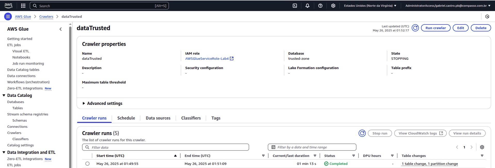
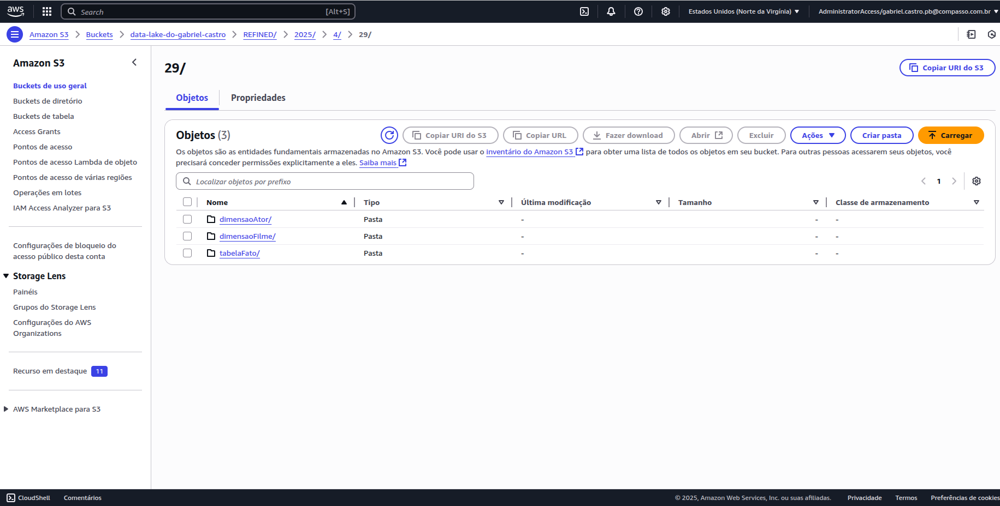

# README DESAFIO SPRINT 7

**Esse desafio tem como objetivo fazer com que os dados das duas bases sejam unidos e complementados, garantindo assim uma maior possibilidade de análises diante das informações.**

A execução do desafio foi dividida em:

- Corrigir erros das sprints anteriores.
- Criar o Diagrama
- Implementar e testar o código em um container localmente.
- Rodar o código no Glue.
- Rodar o Crawler.
- Testar no Athena.

## Corrigir erros das Sprints Anteriores

Foi interpretado errado a questão de complementar os dados. Ao invés de pegar filmes que estam na base de dados on-premise para que eles fossem unidos, os dados que foram requisitados da API se referiam a filmes diferentes.

Dessa forma, foi necessário requisitar os dados novamente para a camada RAW, fazendo apenas uma alteração no código que estava no AWS Lambda.


**Foi apenas alterada a condição do if para que, se fosse encontrado o filme, os dados do TMDB seriam adicionados.**

### Fazendo todo o processo novamente...

Executando a função Lambda:


Alterando caminho no Job do Glue:


Job executado com sucesso:
- Mensagem
- Arquivos


Excluindo base de dados antiga para executar o crawler:


Executando o Crawler:


Testando no Athena:

- Linhas em que os filmes corresponderam:


## Implementar e testar o código em um container localmente

Com o objtivo de gastar o mínimo possível com o Glue, foi utilizado um container oferecido pela própria AWS para executar o código:

https://docs.aws.amazon.com/glue/latest/dg/aws-glue-programming-etl-libraries.html#glue-local


## Criar o diagrama

Colunas de cada uma:

|Colunas da base LOCAL (12)|
| ------------- |
|id|
|titulopincipal|
|titulooriginal|
|anolancamento|
|tempominutos|
|notamedia||
|numerovotos|
|generoartista|
|personagem|
|nomeartista|
|anonascimento|
|anofalecimento|
|profissao|
|titulosmaisconhecidos|
|genero|

|Colunas da base TMDB (12)|
| ------------- |
|adult|
|id|
|original_language|
|original_title|
|overview|
|popularity|
|poster_path|
|release_date|
|title|
|video|
|vote_average|
|vote_count|
|genero|

**titulooriginal = original_title, ou seja, da pra unir a partir dele e manter todas as informações das duas tabelas**

Foram identificados problemas significativos relacionados principalmente à Primeira e à Segunda Forma Normal. Com relação à **Primeira Forma Normal**, que estabelece que toda tabela deve possuir uma chave primária bem definida e que cada célula contenha um único valor atômico, observou-se uma violação: os filmes aparecem repetidos na tabela porque cada registro corresponde a um ator diferente associado ao mesmo filme. A solução adequada para atender a essa forma normal seria separar as informações dos atores e dos filmes em tabelas distintas, vinculando-as por meio da chave primária dos filmes. Assim, seria possível estruturar uma relação muitos-para-muitos, criando uma tabela fato que associaria as chaves dos filmes às dos atores.

Relacionado à **Segunda Forma Normal**, o problema está no fato de que alguns campos da tabela dependem apenas de parte da chave composta, como o título e o ano de lançamento, que dependem apenas do identificador do filme, e não da combinação com o ator. Para corrigir essas violações, é necessário separar os dados de filmes e atores em tabelas distintas e criar uma tabela fato, que associe os filmes aos atores, permitindo a eliminação das dependências parciais e garantindo a integridade das chaves primárias.

**O diagrama ficou dessa forma:**


### Iniciando container

Para rodar o container foi utilizado o comando:

```
sudo docker run -it --name glue_jupyter -p 8888:8888 -v "$(pwd)":/home/glue_user/workspace 89113e5e2035
```

Esse comando permite que haja um tunelamento entre as portas do meu sistema operacional com o container. Também faz um espelho entre a pasta em que os arquivos estão e uma pasta dentro do container (utilizando bind volume).


### Elaborando o código

---

**Leitura dos arquivos:**

```
df_tmdb  = spark.read.parquet(TMDB_PARQUET) # Lendo base do TMBD
df_local = spark.read.parquet(LOCAL_PARQUET) # Lendo base on-premisse

```

--- 

**Casting para garantir a corretude dos dados:**

```
CASTS_TMDB = {"popularity": "double", "vote_average": "double", "vote_count": "int"}
for c, typ in CASTS_TMDB.items(): # Pega chave e valor
    if c in df_tmdb.columns: # se a chave esta nas colunas do DataFrame
    #faz o casting para o tipo correto de acordo com o dicionário
        df_tmdb = df_tmdb.withColumn(c, F.col(c).cast(typ)) 

if "release_date" in df_tmdb.columns and str(df_tmdb.schema["release_date"].dataType) == "StringType":
    df_tmdb = df_tmdb.withColumn("release_date", F.to_date("release_date", "yyyy-MM-dd"))

#Dicionário com os tipos definidos
CASTS_LOCAL = {
    "anolancamento": "int",
    "tempominutos" : "int",
    "notamedia"    : "double",
    "numerovotos"  : "int",
    "anonascimento": "int",
    "anofalecimento": "int",
}

# Para cada item do dicionario, verifica se ele está no DataFrame da base Local e faz o casting para o respectivo tipo.
for c, typ in CASTS_LOCAL.items():
    if c in df_local.columns:
        df_local = df_local.withColumn(c, F.col(c).cast(typ))

```
--- 

**Função slugfy**

```

@F.udf(returnType=T.StringType())
def slugify(txt):
    if txt is None:
        return None
    # 1. Remove acentos (normalização NFD + filtragem da categoria Mn)
    txt = unicodedata.normalize("NFD", txt)
    txt = "".join(ch for ch in txt if unicodedata.category(ch) != "Mn")
    # 2. Converte para minúsculas
    txt = re.sub(r"[^A-Za-z0-9]", "", txt.lower())
    # 3. Tira os espaços e retorna
    return txt.strip()

df_tmdb  = df_tmdb .withColumn("slug", slugify("original_title"))
df_local = df_local.withColumn("slug", slugify("titulooriginal"))

```

Isso é necessário uma vez que estamos o titulo como uma chave natural para identificar linhas pares nas duas bases de dados, dessa forma um nome como “Amélie Poulain” e “Amelie Poulain” viram o mesmo slug (ameliepoulain).

--- 

**Dimensão Filme (Parte Local)**

```
filmes_local = (df_local
    .select("slug",
            F.col("titulooriginal").alias("titulo_original_local"),
            F.col("titulopincipal").alias("titulo_principal_local"),
            "anolancamento", "tempominutos",
            F.col("notamedia").alias("nota_media_local"),
            F.col("numerovotos").alias("num_votos_local"),
            "genero")
    .dropDuplicates(["slug"]))
```

O select faz com que apenas as colunas desejadas para filmes sejam devidamente selecionadas e renomeadas e retira as linhas que possuem filmes duplicados por meio do slug, criado anteriormente.

---

**Dimensão Ator**

```
norm_name = F.lower(F.regexp_replace(F.trim(F.col("nomeartista")), r"\s+", " "))

atores_raw = (df_local
    .withColumn("nomeartista_norm", norm_name)
    .select("nomeartista_norm", "generoartista",
            "anonascimento", "anofalecimento",
            "profissao", "titulosmaisconhecidos")
    .dropDuplicates(["nomeartista_norm"]))

w_ator = Window.orderBy("nomeartista_norm")
dim_ator = atores_raw.withColumn("ator_sk", F.row_number().over(w_ator))
```

Normaliza o nome para que seja fácil identificar os atores e atrizes mesmo que o nome esteja um pouco diferente entre as linhas. Com o select, renomeia algumas colunas e seleciona apenas os dados de atores e atrizes e ignora os filmes. Alem disso, remove atores duplicados através de seu nome normalizado, por conta de aparecem em mais de um filme.


---

**Tabela Fato Temporária**

```

fato_tmp = (
    df_local
      .withColumn("nomeartista_norm", norm_name)
      .select("slug", "nomeartista_norm", "personagem")
      .distinct()
)

```

Cada linha representa um ator interpretando um personagem em um filme. O .distinct() elimina duplicatas caso o mesmo trio apareça repetido. Esse dataframe ainda não tem filme_sk nem ator_sk; eles serão anexados na próxima etapa, quando juntarmos com dim_filme e dim_ator. Essa tabela é basicamente uma preparação para quando os dados estiverem prontos.

**DIMENSÃO FILME (JOIN TMDB × LOCAL)**


```
dim_filme = (local_clean
    .join(tmdb_clean, "slug", "full_outer")
    .withColumn("filme_sk", F.dense_rank().over(w_filme))  # ou row_number()
    .select(
        "filme_sk", "slug",
        F.coalesce("t.original_title",  "l.titulo_original_local").alias("titulo_original"),
        F.coalesce("t.title",           "l.titulo_principal_local").alias("titulo_principal"),
        F.coalesce(F.year("t.release_date"), "l.anolancamento").alias("ano_lancamento"),
        F.coalesce(
            "t.release_date",
            F.to_date(F.concat_ws('-', "l.anolancamento", F.lit('01'), F.lit('01')))
        ).alias("data_lancamento"),
        F.coalesce(tmdb_runtime, F.col("l.tempominutos")).alias("duracao_minutos"),
        F.coalesce("t.vote_average", "l.nota_media_local").alias("nota_media"),
        F.coalesce("t.vote_count",   "l.num_votos_local").alias("num_votos"),
        F.coalesce(tmdb_genres, F.col("l.genero")).alias("genero"),
        "t.overview", "t.poster_path", "t.original_language",
        "t.adult", "t.video", "t.popularity"
    ))
```

Esse código em PySpark cria uma dimensão de filmes juntando dados de duas fontes: uma base local (local_clean) e uma do TMDB (tmdb_clean), usando um full_outer join pela coluna slug. Para cada campo (título, ano, duração, etc.), o código escolhe o valor mais completo com coalesce, priorizando o TMDB e usando o local quando necessário.

Ele também gera uma chave substituta única para cada filme (filme_sk) com dense_rank em uma janela de ordenação. Por fim, inclui campos extras do TMDB como resumo, idioma, e popularidade, resultando em uma tabela unificada para análises ou Data Warehouse.


**Criar Tabela Fato**

```
fato_filme_ator = (fato_tmp
    .join(dim_filme.select("filme_sk", "slug"), "slug")
    .join(dim_ator.select("ator_sk", "nomeartista_norm"), "nomeartista_norm")
    .select("filme_sk", "ator_sk", "personagem"))
```
Esse código cria a tabela fato fato_filme_ator, que liga filmes e atores através de seus identificadores. Ele junta fato_tmp com as dimensões dim_filme (usando slug como chave) e dim_ator (usando nomeartista_norm como chave). A tabela final seleciona apenas o ID do filme (filme_sk), o ID do ator (ator_sk) e o nome do personagem interpretado. Assim, o resultado representa um relacionamento muitos-para-muitos entre filmes e atores.


## Executar JOB

Criando configuração IAM:


Criando o job no Glue:


Configurando o job no Glue:


Job executado com sucesso:


Verificando no S3:

## Crawler
Configurando Crawler:


Executando Crawler:


## AWS Athena
Verificando Corretude no Athena:


