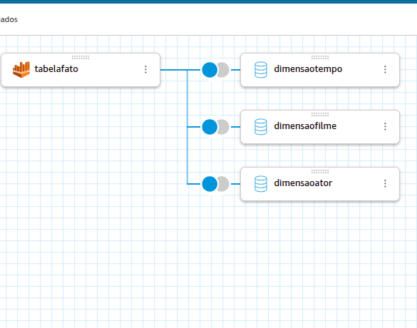

# README SPRINT 8 - DESAFIO FINAL

## OBJETIVOS

 - Corrigir erros da Sprint passada
 - Realizar um planejamento de Storytelling
 - Projetar o Dashboard
 - Resultados
 - Dar um panorama do que foi feito, dos dados brutos até o dash

 ### Corrigindo erros da Sprint 7

Um dos objetivos da Sprint anterior era a realização da modelagem dimensional. Infelizmente essa modelagem foi realizada da maneira errada, pois faltaram dados na tabela fato e a criação da dimensão tempo. Dessa forma, foram feitas correções no código para que a modelagem fosse modificada. Os passos foram basicamente:

- Excluir os dados modelados errados do S3 e da base de dados
- Fazer as pequenas modificações no código do Job para criar a modelagem correta
- Executar o Job
- Executar o Crawler

**OBS: Como não é o objetivo dessa Sprint, o código não será mostrado**

Dados corretos no S3 

### Realizar o planejamento do Storytelling

Com os dados coletados, é possível obter uma análise bastante clara em relação ao sucesso de filmes e atores em determinado tempo, uma vez que estão presentes métricas como popularidade, nota do filme e a data de seu lançamento. Além disso, temos os artistas envolvidos nessas produções.

A ideia principal foi escolher um intervalo de tempo longo e popular para determinar o que fez sucesso, e o que não fez, tanto para artistas quanto para filmes. Dessa forma, foi escolhida a década de 90 para delimitar essa resposta. O objetivo principal é analisar métricas de sucesso do cinema nos anos 90.

Para isso, foram elaboradas perguntas orientadoras. Cada pergunta traz uma hipótese ou um objetivo de análise, e foi representada por um gráfico específico no dashboard:

#### Quantos filmes foram lançados? (P1)

Essa métrica serve para mensurar o quanto foi produtivo o cinema nesse intervalo de tempo. Para isso, foi utilizado um KPI, já que será apenas um valor agregado mostrado no dashboard.

#### Quantos artistas envolvidos?(P2)

Essa métrica tem por objetivo mostrar o nível de participação de artistas no cinema da década de 90, indicando se houve uma concentração em poucos nomes ou se muitos artistas participaram de forma diversificada. Também é um KPI, representando um número total.

#### Qual é o tempo médio dos filmes?(P3)

Essa pergunta busca entender o padrão de duração dos filmes lançados nessa época. A média de tempo pode ajudar a identificar tendências de produção (ex: filmes mais longos ou curtos). Será utilizada uma métrica simples (KPI) com o valor médio.

#### Quantos filmes foram lançados em cada ano?(P4)

Essa visualização mostra a evolução da produção cinematográfica ao longo da década. Com isso, é possível observar picos ou quedas na produção. O gráfico utilizado será uma linha temporal (gráfico de linhas).

#### Existe uma relação entre a quantidade e a popularidade?(P5)

Aqui o objetivo é verificar se os anos com mais lançamentos também foram os que tiveram os filmes mais populares. A ideia é cruzar quantidade vs. popularidade, o que pode ser mostrado com um gráfico de barras com linhas combinadas.

#### Quais foram os filmes de maior popularidade?(P6)

Esta análise visa destacar os principais sucessos da década de 90 segundo a métrica de popularidade. Será utilizado um gráfico de barras horizontais mostrando os filmes mais populares em ordem decrescente.

#### Quais foram os artistas de maior popularidade?(P7)

Da mesma forma que os filmes, essa análise destaca os artistas mais populares, permitindo compreender quem esteve mais em alta na década. Nessa métrica foi utilizada uma tabela.

#### Existe uma relação entre a popularidade e a nota do filme?(P8)

Essa pergunta visa identificar se filmes mais populares também foram bem avaliados (ou não). O gráfico mais indicado é o gráfico de dispersão, com a popularidade no eixo X e a nota no eixo Y.

***Obs: De acordo com as respostas para essas perguntas, será possível determinar tendências de crescimento, com artistas e subcategorias do gênero ação que fazem sucesso**

### Projetar o Dashboard

#### Preparar os dados para a análise

Para projetar o dashboard, é necessário adicionar as bases de dados ao QuickSight.

Após isso, é necessário juntar as tabelas para que a análise no QuickSight seja possível. Portanto, foram feitos joins da tabela fato com todas as outras dimensões(Tempo, Artista e Filme)

Depois dos Joins, foi necessário alterar os tipos de algumas colunas que foram adicionadas, como popularidade e nota_media.

#### Analisar

**OBS: É importante ressaltar que, para todos os gráficos e medidas, foi adicionado o filtro para que sejam apenas dados dos anos 90**

##### Quantos filmes foram lançados? (P1)

Para conseguir esse resultado, basta selecionar os filmes_sk distintos:

##### Quantos artistas envolvidos?(P2)

O mesmo raciocínio da P1 ocorre com o número de artistas

##### Qual é o tempo médio dos filmes?(P3)

Para responder essa pergunta, bastou arrastar o campo de duração_minutos para o valor e selecionar a média.

##### Quantos filmes foram lançados em cada ano?(P4)

Basicamente, para descobrir o resultado, o gráfico de linhas deveria ter os anos no eixo X, como uma linha do tempo, e a quantidade de filmes no Eixo Y, para determinar a tendência. É claro que foi preciso ordenar os anos no gráfico.

##### Existe uma relação entre a quantidade e a popularidade? (P5)

Para mostrar essa relação do melhor jeito, a popularidade foi colocada com uma linha e a contagem de filmes como barras, para que uma boa comparação seja estabelecida.

É Importante dizer que a popularidade média foi estabelecida, uma vez que se um ano tiver número de lançamentos maior, a popularidade somada vai ser maior, impossibilitando a análise.

##### Quais foram os filmes de maior popularidade?(P6)

Para projetar esse gráfico, basta selecionar a popularidade(Média), uma vez que pode existir mais de um filme por linha, junto com os títulos.

##### Quais foram os artistas de maior popularidade?(P7)

Nesse caso, como só é possível o artista aparecer uma vez em cada filme, foi selecionada a popularidade(Soma), pois, mesmo que o filme não tenha feito sucesso, foi uma aparição do artista que contou para sua popularidade, mesmo que negativamente.

##### Existe uma relação entre a popularidade e a nota do filme?(P8)

Nesse caso, o gráfico de dispersão serviu como uma luva, pois permite analisar se existe uma tendência entre duas métricas. Nesse caso a popularidade a nota.

# A Década de 90 no Cinema – Análise Detalhada do Dashboard

> **Objetivo do Dashboard**  
> Investigar o sucesso do cinema de **ação e aventura** nos anos 90, combinando métricas de produção (quantidade de filmes), desempenho (popularidade, nota) e participação de artistas.

---

## 1. Visão Geral das Métricas-Chave

| Métrica                              | Valor | Interpretação rápida                                                                 |
|--------------------------------------|-------|---------------------------------------------------------------------------------------|
| **Duração média dos filmes**         | **104 min** | Padrão comercial da época: ritmo dinâmico, sem excessos de duração.                   |
| **Número total de filmes**           | **4 330** | Mostra **alta produtividade** do gênero na década.                                    |
| **Número de artistas envolvidos**    | **11 500** | Expõe o quanto o setor movimentou em termos de elenco e equipe.                       |

---

## 2. Evolução Temporal de Lançamentos

- **Tendência descendente**: 1990 começa perto dos **500 títulos**; 1999 fecha abaixo de **400**.  
- **Picos notáveis**:  
  - **1993** – fortalecimento de blockbusters (ex.: *Jurassic Park*).  
  - **1996** – explosão de sequências e franquias (*Mission: Impossible*, *Independence Day*).  
- **Possíveis explicações**:  
  1. **Saturação** do mercado → estúdios passam a investir mais em **qualidade** do que em volume.  
  2. Adoção crescente de **efeitos digitais** encarece produções, reduzindo quantidade anual.  

---

## 3. Popularidade vs. Volume de Lançamentos

- Apesar da **queda** de lançamentos, a **popularidade média** *permanece estável* ou levemente crescente.  
- Indica **concentração de recursos** em filmes mais impactantes, capazes de sustentar o interesse do público com menos títulos.

---

## 4. Destaques de Popularidade

| Posição | Filme                | Observação                                              |
|---------|----------------------|---------------------------------------------------------|
| 1       | **Mission: Impossible** | Marca o retorno do cinema-espionagem em grande escala. |
| 2       | The Matrix           | Revolucionou efeitos visuais e narrativa cyberpunk.     |
| 3       | Gladiator            | Mistura ação épica e drama, sucesso de crítica e público|
| 4       | Toy Story            | Primeiro longa 100 % CGI → marco tecnológico/disruptivo |
| 5       | Mulan                | Reflete diversidade crescente na animação da Disney.    |

---

## 5. Artistas Mais Populares

| Rank | Artista              | Popularidade¹ | Principais marcos nos anos 90                           |
|------|----------------------|---------------|---------------------------------------------------------|
| 1    | **Tom Cruise**       | 102,86        | *Mission: Impossible*, *Entrevista com o Vampiro*       |
| 2    | Jon Voight           | 62,23         | *Heat*, *Anaconda*                                      |
| 3    | Emmanuelle Béart     | 56,88         | *Mission: Impossible*                                   |
| 4    | Henry Czerny         | 56,83         | *Mission: Impossible*, *Clear and Present Danger*       |
| 5    | Will Smith           | 43,18         | *Independence Day*, *Men in Black*                      |

¹ Escala relativa calculada pelo dataset.

**Insight-chave**: presença recorrente dos mesmos nomes mostra a força das **franquias** como motor de popularidade.

---

## 6. Popularidade x Nota (Qualidade Crítica)

- **Quadrante superior direito** (Alta popularidade + Alta nota)  
  - *Gladiator* – caso clássico de **sucesso crítico e comercial**.  
- **Alta popularidade, nota mediana**  
  - *Armageddon*, *The Mummy* – fortes em bilheteria, mas divisivos para críticos.  
- **Boa nota, baixa popularidade**  
  - Filmes cult ou nichados, valorizados pela crítica mas sem grande apelo de massa.  

> **Conclusão**: popularidade **≠** qualidade. O público valoriza espetáculo, enquanto a crítica pesa narrativa e originalidade.

---

## 7. Principais Conclusões

1. **Produção Abundante, porém em Declínio**  
   - Os anos 90 iniciam com alto volume e gradualmente reduzem, indicando transição de estratégia.
2. **Blockbusters & Franquias Lideram o Interesse**  
   - Investimento em sagas com nomes de peso assegura retorno mesmo com menos lançamentos.
3. **Tom Cruise simboliza a década**  
   - Seu domínio reflete preferência por heróis carismáticos em narrativas de ação-espionagem.
4. **Equilíbrio raro entre crítica e bilheteria**  
   - Exemplos como *Gladiator* servem de benchmark para futuros projetos.
5. **Oportunidades de Estudos Futuros**  
   - Analisar outros gêneros ou cruzar dados de orçamento vs. receita para dimensões econômicas adicionais.

---

