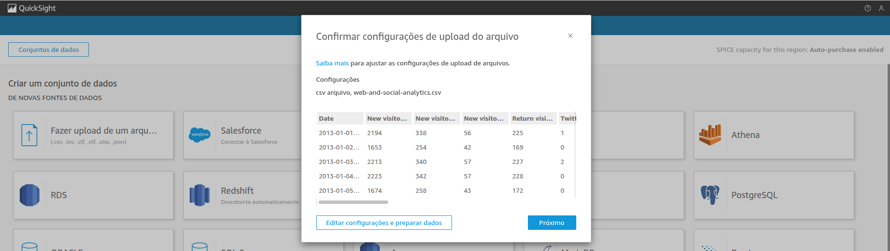

# Resumo (Feedback dos cursos)

**Complete Introduction to Amazon QuickSight:** O curso é excelente, pois permite que uma pessoa que nunca teve contato com o QuickSight ou qualquer outra ferramenta de BI tenha uma boa experiência. Gostei bastante do foco que foi dado em tabelas, uma vez que elas são muito importantes e ponto de partida para o entendimento de qualquer outra ferramenta presente do QuickSight.  
**Amazon QuickSight - Getting Started:** Como todos os cursos que a AWS oferece, mostrou um conteúdo detalhado e muito bem escrito sobre o que é preciso saber sobre o QuickSight, principalmente sobre seus elementos visuais, como o KPI e AutoGraph.

# Laboratório

1-**Entrar no QuickSight**

2-**Ir até a seção de adicionar conjunto de dados e clicar em "Novo conjunto de dados"**

3-**Escolher a opção csv e adicionar o arquivo**

4-**Mostrando dados para upload**

5-**Mostrando dados para upload**

6-**Criando gráfico e escolhendo a opção de mês**

7-**Exercício concluído**

# Evidências

[Fotos de Confirmação](./Evidencias)

# DESAFIO

[DESAFIO](./Desafio)